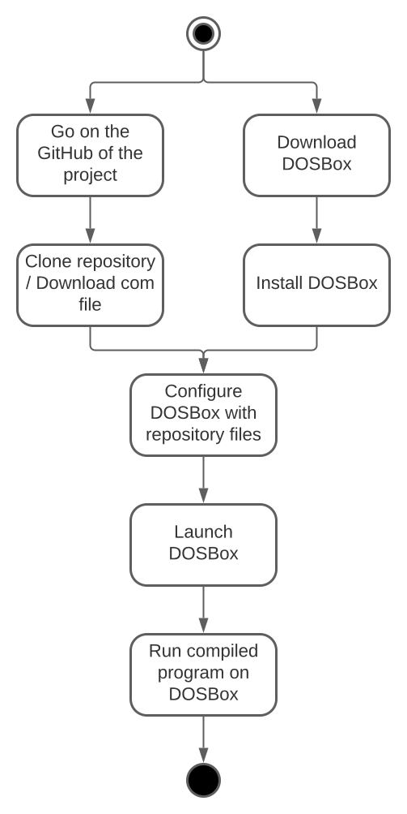

# Pac-Man Project Test Plan

- [Pac-Man Project Test Plan](#pac-man-project-test-plan)
  - [1. Product Analysis](#1-product-analysis)
  - [2. Test Strategy](#2-test-strategy)
    - [Overview:](#overview)
      - [Key Components:](#key-components)
    - [1. Setting up DOSBox for Development and Testing](#1-setting-up-dosbox-for-development-and-testing)
      - [Step 1: Download and Install DOSBox](#step-1-download-and-install-dosbox)
      - [Step 2: Configure DOSBox for Development](#step-2-configure-dosbox-for-development)
      - [Step 3: Install an Assembler](#step-3-install-an-assembler)
    - [2. Setting Up GitHub for Bug Reporting](#2-setting-up-github-for-bug-reporting)
      - [Step 1: Create a Repository](#step-1-create-a-repository)
      - [Step 2: Enable GitHub Issues](#step-2-enable-github-issues)
    - [3. Managing Test Cases with Excel](#3-managing-test-cases-with-excel)
      - [Step 1: Create an Excel Spreadsheet](#step-1-create-an-excel-spreadsheet)
      - [Step 2: Populate Test Cases](#step-2-populate-test-cases)
    - [4. Starting Testing](#4-starting-testing)
    - [5. Reporting Bugs on GitHub](#5-reporting-bugs-on-github)
    - [6. Managing the Testing Process](#6-managing-the-testing-process)
  - [3. Objectives](#3-objectives)
    - [Overview:](#overview-1)
      - [Key Objectives:](#key-objectives)
  - [4. Test Criteria](#4-test-criteria)
    - [Overview:](#overview-2)
      - [Key Criteria:](#key-criteria)
  - [5. Resource Allocation](#5-resource-allocation)
    - [Overview:](#overview-3)
      - [Key Considerations:](#key-considerations)
  - [6. Test Environment](#6-test-environment)
    - [Overview:](#overview-4)
      - [Key Points:](#key-points)
  - [7. Test Schedule and Estimation](#7-test-schedule-and-estimation)
    - [Overview:](#overview-5)
    - [Code Testing](#code-testing)
      - [Key Steps:](#key-steps)
      - [Steps Time Estimation:](#steps-time-estimation)
      - [Schedule:](#schedule)
    - [Documentation Testing](#documentation-testing)
      - [Key Steps:](#key-steps-1)
      - [Steps Time Estimation:](#steps-time-estimation-1)
      - [Schedule:](#schedule-1)
  - [8. Test Deliverables](#8-test-deliverables)
    - [Overview:](#overview-6)
      - [Before Testing:](#before-testing)
      - [During Testing:](#during-testing)
      - [After Testing:](#after-testing)
  - [SMOKE TESTING](#smoke-testing)


## 1. Product Analysis

This project targets a diverse audience, from those well-acquainted with the original Pac-Man to individuals who may be discovering the game for the first time. With a dual purpose, the product aims to serve as an educational tool for learning assembly language coding and as an entertainment game.

We will illustrate the operational flow of the software and provide a visual representation through a diagram. For further details, refer to the [functional specifications](../functional/functional-specifications.md) document.



The software specifications encompass the DOSBox emulator, while the hardware requirements include an emulator with a 16-bit processor, X86 architecture, 65,536 bytes of RAM.


## 2. Test Strategy

### Overview:
The Test Strategy document outlines project objectives, effort estimation, scope, and types of testing.

#### Key Components:
- Scope of Testing
- Type of Testing
- Risks and Issues
- Test Logistics


### 1. Setting up DOSBox for Development and Testing

#### Step 1: Download and Install DOSBox

Download and install DOSBox. You can find the latest version on the official [DOSBox website](https://www.dosbox.com/). Follow the installation instructions provided.

#### Step 2: Configure DOSBox for Development

1. Launch DOSBox.
2. Mount a directory where you'll store your project files using the following command:
   ```
   mount C C:\path\to\your\pacmanProject
   ```
   Replace `C:\path\to\your\pacmanProject` with the actual path to your project directory.

#### Step 3: Install an Assembler

Install an x86 assembler in DOSBox to write and compile assembly code. The technical team chose to pick NASM (Netwide Assembler) as the reference. 

### 2. Setting Up GitHub for Bug Reporting

#### Step 1: Create a Repository

Create a new repository on GitHub to manage your project. This will be used for version control and bug tracking.

#### Step 2: Enable GitHub Issues

In your repository settings, navigate to the "Issues" section and make sure issues are enabled. This will allow you to create and track bug reports.

### 3. Managing Test Cases with Excel

#### Step 1: Create an Excel Spreadsheet

Create a new Excel spreadsheet to document your test cases. Organize it with columns for test ID, test description, steps to reproduce, expected result, actual result, and status.

#### Step 2: Populate Test Cases

Based on the test plans provided, fill in the test cases with specific details, including expected outcomes and any additional notes.

### 4. Starting Testing

With the environment set up, you're ready to begin testing. Use the DOSBox environment to execute the assembly code and perform the tests outlined in your Excel spreadsheet.

### 5. Reporting Bugs on GitHub

When you encounter a bug during testing, follow these steps to report it:

1. Go to your project's GitHub repository.
2. Click on the "Issues" tab.
3. Click "New Issue" to create a new bug report.
4. Provide a descriptive title and detailed description of the bug.
5. Include steps to reproduce the bug, expected behavior, and actual behavior.
6. Assign labels, milestones, and assignees if applicable.
7. Submit the issue.

### 6. Managing the Testing Process

Regularly update your Excel spreadsheet with test results, including any bugs encountered. Use the GitHub issues to track and manage bug fixes and progress.


## 3. Objectives

### Overview:
Define the goals and expected results of test execution.

#### Key Objectives:
- Test all software features (functionality, GUI, performance standards).
- Set benchmark results for each aspect of the software.

## 4. Test Criteria
### Overview:
Establish standards or rules governing all activities in the testing project.

#### Key Criteria:
- Suspension Criteria
- Exit Criteria

## 5. Resource Allocation
### Overview:
Plan human resources, equipment, and infrastructure needed for testing.

#### Key Considerations:
- Determine required resources (testers, equipment).
- Calculate schedule and effort estimation.

## 6. Test Environment 

### Overview:
Create the software and hardware setup for accurate testing.

#### Key Points:
- Real devices for comprehensive testing.
- Avoid compromising results with emulators or simulators.

## 7. Test Schedule and Estimation

### Overview:

Testing tasks are divided into two parts: code testing and documentation testing. We chose to split the work into two parts because it would allow us to work in parallel and to have a better overview of the project.

### Code Testing 

To test the code of the wall project we chose to split the work into 4 key steps.

#### Key Steps:

1. Create a unit test template and give it to all developers. Each developer will then write their unit tests for their functions.
2. Write unit tests for each project function; it will help us to find bugs and errors in the code. This part will be done in parallel with the development of the project.
3. Automate tests with GitHub Actions, this will allow us to run tests automatically after each commit and avoid errors on the main branch. This will also permit to have an integrated overview of failure and coverage of the code directly in GitHub.
4. Create functional tests and take a screenshot of the game at each step and in case of error. This will allow us to have a visual overview of the game and to see if the game is working as expected.

#### Steps Time Estimation:
| Step | Time | Comment |
| --- | --- | --- |
| Create a unit test template | 1/2 day | |
| Write unit tests |  | This part will be done in parallel with the development of the project. |
| Automate tests with GitHub Actions | 1 week | |
| Create functional tests | 1 week | |

#### Schedule:
| Step | Start Date | End Date |
| ---- | ---------- | -------- |
| Create a unit test template | 2023/11/13 | 2023/11/13 |
| Write unit tests | 2023/11/13 | 2023/12/22 |
| Automate tests with GitHub Actions | 2023/11/27 | 2023/12/03 |
| Start test session | / | / |


### Documentation Testing

To test the documentation of the wall project we chose to split the work into 3 key steps.

#### Key Steps:
1. Use a template for each documentation part and give it to all developers. Each developer will then write their documentation part.
2. Organize a meeting with all developers to review the documentation and make sure that it is clear and understandable for everyone.
3. Review the documentation and make sure that it is clear and understandable for everyone.

#### Steps Time Estimation:
| Step | Time | Comment |
| --- | --- | --- |
| Create and give template for documentation | 1-2 days | |
| Organize a meeting with all developers | 1 hour | Meeting are planned every week. |
| Review the documentation | 1-2 days | Review are planned every week. |
| Unit tests | 1-2 days | Unit test will be done in parallel with the development of the project. |
| Test session | 1 hour | Test session will be done 1-3 times every week. |
| GitHub Actions | 1 week | |
| Coverage script | 1 week | |
| Unit test formater script | 1 week | |

#### Schedule:
| Step | Start Date | End Date |
| ---- | ---------- | -------- |
| Create and give template for documentation | 2023/11/13 | 2023/11/13 |
| Organize a meeting with all developers | 2023/11/13 | 2023/12/22 |
| Review the documentation | 2023/11/20 | 2023/12/22 |
| Unit tests | 2023/11/13 | 2023/12/22 |
| Test session | 2023/11/20 | 2023/12/22 |
| GitHub Actions | 2023/11/27 | 2023/12/03 |
| Coverage script | 2023/12/04 | 2023/12/10 |
| Unit test formater script | 2023/12/04 | 2023/12/10 |

## 8. Test Deliverables 
### Overview:
List of documents, tools, and equipment required to support testing activities.

#### Before Testing:
- Test Plan
- Test Design

#### During Testing:
- Test Scripts
- Simulators or Emulators (in early stages)
- Test Data
- Error and execution logs

#### After Testing:
- Test Results
- Defect Reports
- Release Notes


## SMOKE TESTING
Doing test wihtout having a real plan just the intention to find bugs 