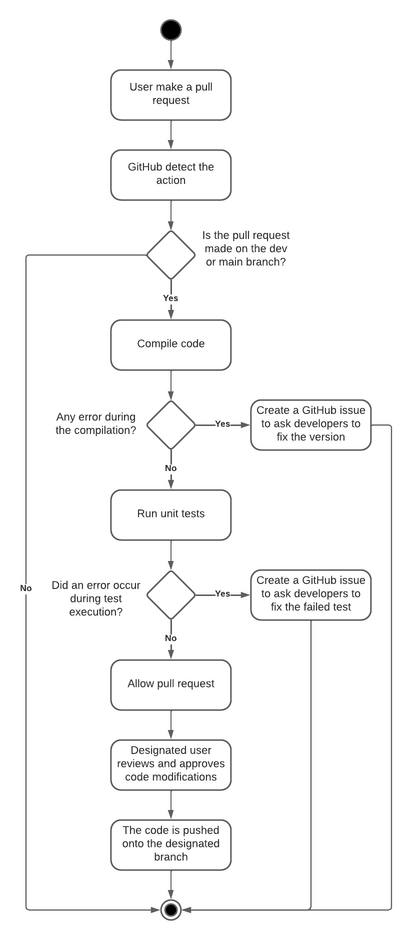
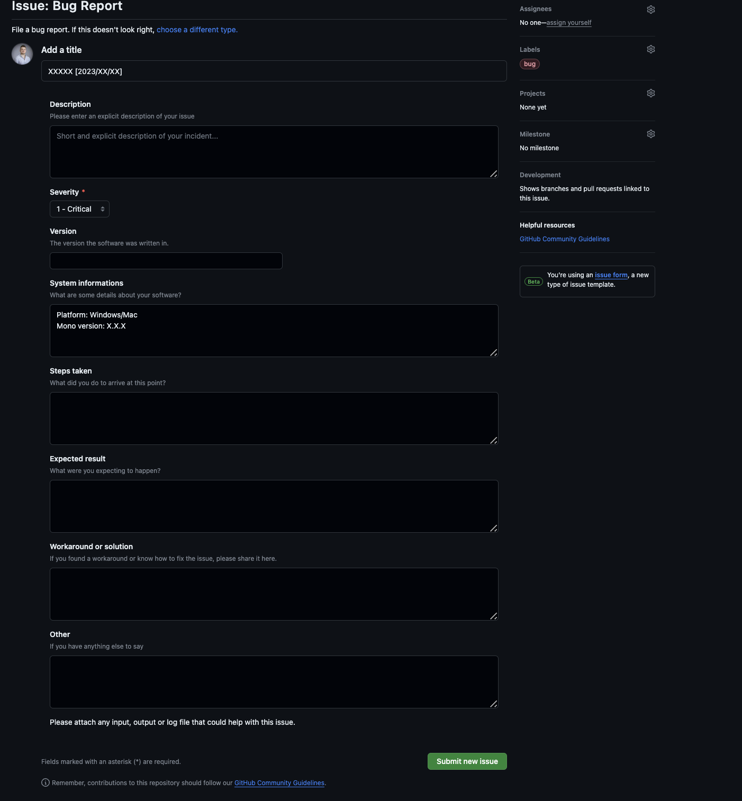
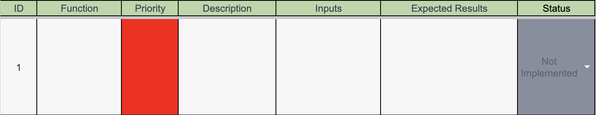
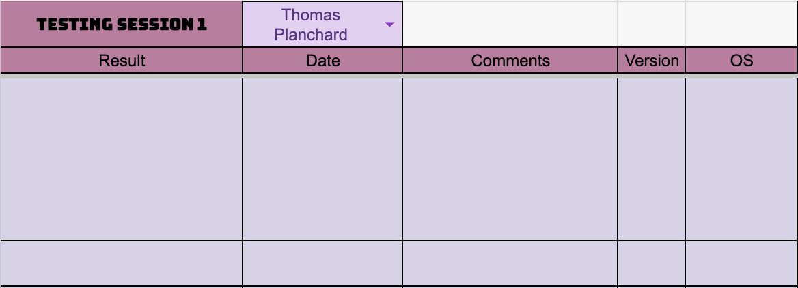
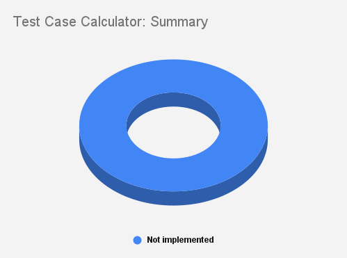
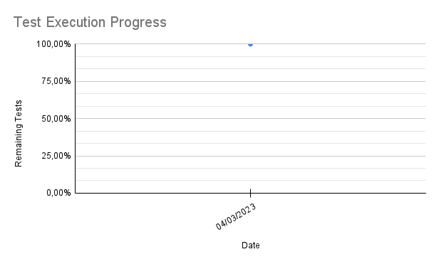

# Pac-Man Project Test Plan

Table of Contents

- [Pac-Man Project Test Plan](#pac-man-project-test-plan)
  - [1. Product Analysis](#1-product-analysis)
    - [1.2. Overview](#12-overview)
  - [2. Glossary](#2-glossary)
  - [3. Strategy](#3-strategy)
    - [3.1. Scope of Testing](#31-scope-of-testing)
      - [3.1.1. In-scope for Testing](#311-in-scope-for-testing)
      - [3.1.2. Out-of-scope for Testing](#312-out-of-scope-for-testing)
    - [3.2. Unit Tests](#32-unit-tests)
    - [3.3. Tests Structure](#33-tests-structure)
    - [3.4. Tests List](#34-tests-list)
      - [3.4.1. Scoring Mechanisms](#341-scoring-mechanisms)
      - [3.4.2. Game Dynamics](#342-game-dynamics)
    - [3.5. Game-testing sessions](#35-game-testing-sessions)
      - [3.5.1. Overview](#351-overview)
      - [3.5.2. Smoke Testing](#352-smoke-testing)
        - [3.5.2.1. Smoke Testing Scope](#3521-smoke-testing-scope)
        - [3.5.2.2. Sequence of Smoke Testing](#3522-sequence-of-smoke-testing)
      - [3.5.3. Collaborative Game-Testing Sessions](#353-collaborative-game-testing-sessions)
        - [3.5.3.1. Session Scope](#3531-session-scope)
        - [3.5.3.2. A Sequence of a Session](#3532-a-sequence-of-a-session)
    - [3.6. Monitoring and tools](#36-monitoring-and-tools)
      - [3.6.1. GitHub](#361-github)
        - [3.6.1.1. GitHub Overview](#3611-github-overview)
        - [3.6.1.2. GitHub Actions](#3612-github-actions)
          - [3.6.1.2.1. GitHub Actions Scope](#36121-github-actions-scope)
          - [3.6.1.2.2. Workflow](#36122-workflow)
          - [3.6.1.2.3. Configuration](#36123-configuration)
      - [3.6.2. GitHub Issues](#362-github-issues)
      - [3.6.3. Tests Report and Meetings](#363-tests-report-and-meetings)
      - [3.6.4. Bug Data Report Spreadsheet](#364-bug-data-report-spreadsheet)
        - [3.6.4.1. Spreadsheet Structure](#3641-spreadsheet-structure)
    - [3.7. Documentation](#37-documentation)
      - [3.7.1. GitHub Wiki](#371-github-wiki)
  - [4. Test Criteria](#4-test-criteria)
    - [4.1. Suspension Criteria](#41-suspension-criteria)
    - [4.2. Exit Criteria](#42-exit-criteria)
  - [5. Allocated Resources](#5-allocated-resources)
    - [5.1. Time](#51-time)
    - [5.2. People](#52-people)
    - [5.3. Testing Environment Requirements](#53-testing-environment-requirements)
  - [6. Test Schedule and Estimation](#6-test-schedule-and-estimation)
    - [6.1. Tasks Time Estimation](#61-tasks-time-estimation)
      - [6.1.1. Schedule](#611-schedule)

---

## 1. Product Analysis

### 1.2. Overview

The project aims to develop a faithful recreation of the classic Pac-Man game using Assembly language, within an emulated 90s computer environment. The primary objective is to deliver an experience that captures the essence of the original Pac-Man gameplay.

This project targets a diverse audience, from those well-acquainted with the original Pac-Man to individuals who may be discovering the game for the first time. With a dual purpose, the product aims to serve as an educational tool for learning assembly language coding and as an entertainment game.

We will illustrate the operational flow of the software and provide a visual representation through a diagram. For further details, refer to the [functional specifications](../functional/functional-specifications.md) document.

The software specifications encompass the DOSBox emulator, while the hardware requirements include an emulator with a 16-bit processor and an X86 architecture.

## 2. Glossary

| Term | Definition | Source |
| ---- | ---------- | ------ |
| **Assembly language** | A low-level programming language for a computer, or other programmable device, in which there is a very strong (generally one-to-one) correspondence between the language and the architecture's machine code instructions. | [Wikipedia](https://en.wikipedia.org/wiki/Assembly_language) |
| **DOS (Disk Operating System)** | An early operating system that provides the essential functions for managing files and running applications on IBM PC-compatible systems. | [Wikipedia](https://en.wikipedia.org/wiki/DOS) |
| **DOSBox** | An emulator program that emulates an IBM PC-compatible computer running a DOS operating system. | [Wikipedia](https://en.wikipedia.org/wiki/DOSBox) |
| **Exploratory testing** | A software testing approach that allows testers to apply their knowledge and expertise to design and execute tests. | [Wikipedia](https://en.wikipedia.org/wiki/Exploratory_testing) |
| **GitHub** | A web-based version control and collaboration platform for software developers. | [Wikipedia](https://en.wikipedia.org/wiki/GitHub) |
| **GitHub Actions** | A CI/CD tool that allows us to run tests automatically after various actions on the repository and avoid errors on the dev or main branch. | [GitHub](https://docs.github.com/en/actions) |
| **GitHub Issues** | A tool that allows us to create and manage issues and assign them to team members. | [GitHub](https://docs.github.com/en/issues) |
| **macOS** | A series of proprietary graphical operating systems developed and marketed by Apple Inc. | [Wikipedia](https://en.wikipedia.org/wiki/MacOS) |
| **QuickTime Player** | A media player created by Apple that allows users to play back audio and video in digital format. | [Wikipedia](https://en.wikipedia.org/wiki/QuickTime_Player) |
| **Smoke testing** | A preliminary test that focuses on the major functionality of the software, without bothering with finer details. | [Wikipedia](https://en.wikipedia.org/wiki/Smoke_testing_(software)) |
| **Snipping Tool** | A screenshot utility included in Windows Vista and later. | [Wikipedia](https://en.wikipedia.org/wiki/Snipping_Tool) |
| **Visual Studio Code** | A free source-code editor made by Microsoft for Windows, Linux, and macOS. | [Wikipedia](https://en.wikipedia.org/wiki/Visual_Studio_Code) |
| **Windows** | A group of several proprietary graphical operating system families, all of which are developed and marketed by Microsoft. | [Wikipedia](https://en.wikipedia.org/wiki/Microsoft_Windows) |
| **X86** | A family of instruction set architectures initially developed by Intel based on the Intel 8086 microprocessor and its 8088 variant. | [Wikipedia](https://en.wikipedia.org/wiki/X86) |

---

## 3. Strategy

Our testing strategy employs a multifaceted approach. **[Unit Tests](#unit-tests)** form the bedrock, scrutinizing individual components for functionality. **[Game-testing sessions](#game-testing-sessions)** take center stage, offering a holistic evaluation of gameplay, user interactions, and overall user experience. Augmenting our strategy are sophisticated **[monitoring tools](#monitoring-and-tools)**, enabling real-time analysis of system performance, identifying potential bugs, and ensuring optimal execution.

### 3.1. Scope of Testing

Testing will focus on both core gameplay elements and peripheral features to guarantee a reliable end product. However, it's important to note that certain aspects, such as low-level technical details will be excluded from testing as they are beyond the scope of the test.

#### 3.1.1. In-scope for Testing

- Code
  - Absence of significant bugs
  - Main game mechanics functionality
  - Acceptable visual quality
- Documents
  - Spelling accuracy
  - Typographical errors

#### 3.1.2. Out-of-scope for Testing

- Font details
- Colors of sprites
- Sprite speed

---

### 3.2. Unit Tests

Unit testing is an important part of the process. These tests are developed in X86 assembler and executed on DOSBox, to have an environment as close as possible to the final game.

These tests are developed throughout the project in parallel with game development, corresponding to an exploratory testing approach.

These unit tests serve three crucial objectives:

1. **Code Functionality:** Verify that each function performs as expected under various scenarios. For instance, we ensure that scoring mechanisms function correctly when Pac-Man interacts with different elements.

2. **Code Quality:** Assess the clarity and quality of the code to promote maintainability and ease of collaboration among developers.

3. **Code Coverage:** Guarantee comprehensive testing to prevent future changes from unintentionally altering the original behavior of the code.

### 3.3. Tests Structure

Each test comprises the following components:

1. **Function:** Identifies the function under examination.
2. **Test Description:** Describes the purpose of the test, the specific conditions being evaluated, and the expected outcome.
3. **Severity:** Indicates the criticality of the test, categorized as **High**, **Medium**, or **Low**.

### 3.4. Tests List

#### 3.4.1. Scoring Mechanisms

| Function | Test Description | Severity |
| --- | --- | --- |
| Score when eating a dot | Increment score by 10 | Medium |
| Score when eating a big dot | Increment score by 50 | Medium |
| Score when eating a ghost | Increment score by 200 | Medium |
| Score when eating a cherry | Increment score by 100 | Medium |

#### 3.4.2. Game Dynamics

| Function | Expected Result | Severity |
| --- | --- | --- |
| Clyde behavior | Clyde is supposed to be near PacMan and within 8 pellets he becomes random. | Medium |
| Wall collision (Pac-Man) | Ensure Pac-Man halts at every environmental wall | High |
| Wall collision (Ghost) | Ensure ghosts halt at every environmental wall | High |
| Ghosts collision (Ghost) | Ensure ghosts halt at every other ghost | High |
| Increase lives | Add new life to the player when the user gets 10.000 points | Medium |
| Lives cap | Player can't have more than 5 lives | Medium |
| Lives cap | Player can't have less than 0 lives | Medium |

---

### 3.5. Game-testing sessions

#### 3.5.1. Overview

Due to the difficulty of creating a test bot for an assembler game 
and the time allocated to this project. We will rely on manual 
testing, we will use a combination of **[Smoke Testing](#smoke-testing)** and **[Collaborative Game-Testing Sessions](#collaborative-game-testing-sessions)** to ensure the quality of the game. 

To identify errors as accurately as possible, the tester must record 
his or her screen throughout the test session, using the "Snipping 
tool" on Windows computers and "QuickTime Player" on Apple computers. 
This will allow us to have a visual representation of the errors and 
to be able to reproduce them more easily.

#### 3.5.2. Smoke Testing

Game testing sessions will take place after each project release. These sessions will serve as smoke tests. The primary goal of smoke
testing is to quickly assess whether the essential functionalities of the project are working as expected after each build. This testing
phase is designed to identify critical issues early in the development process, allowing for rapid feedback and swift resolution of
potential show-stopping problems.

##### 3.5.2.1. Smoke Testing Scope

The smoke testing scope will focus on the fundamental aspects of the game. This includes:

1. **Game Launch:** Confirm that the game launches successfully without any critical errors or crashes.
2. **Player Controls:** Verify that basic player controls (up, down, left, right) respond as intended.
3. **Character Movement:** Ensure that Pac-Man moves through the maze at the specified speed without glitches or abnormalities.
4. **Collision Detection:** Validate that collision detection is functioning correctly, especially between Pac-Man and ghosts.
5. **Basic Interactions:** Confirm basic interactions, such as eating dots and encountering ghosts, occur without errors.

##### 3.5.2.2. Sequence of Smoke Testing

During each smoke testing session, the following steps will be executed:

1. **Build Deployment:** Deploy the latest build of the project in the testing environment.
2. **Test Execution:** Execute a set of [predefined test cases](./Test-Cases.md) covering the critical functionalities.
3. **Archiving results:** Archive the test results [here](https://docs.google.com/spreadsheets/d/1Wm9y6b1pe2TSEv-pNZyj7Igid2MQinLGrvEB3opBlmk/edit?usp=sharing) for future reference.
4. **Issue Reporting:** If critical issues are identified, report them to the development team.

---

#### 3.5.3. Collaborative Game-Testing Sessions

To gain a better overview of the project, a collaboration with the [3rd team's quality assurance team](Collaboration-QA.md) was set up. This collaboration enables the 2 teams to have an external view of the game and simply identify errors and bugs. The main advantage of this collaboration is to have several points of view on the same situation and to see or share new working methods.

##### 3.5.3.1. Session Scope

Sessions are designed primarily to:

1. **Verify that the game is working as expected:** Check that all the game's basic and additional game mechanics are working properly.
2. **Sharing tests:** Share tests between the 2 teams to have a better overview of the game and to find more bugs and errors.
3. **Identify bugs and errors:** Find bugs and errors in the game to improve it.
4. **Identify improvements and missing features:** Find improvements and missing features in the game to bring it closer to the original.

##### 3.5.3.2. A Sequence of a Session

A group testing session will take place once a week during one of the hours allocated to the project.
Each session will follow the following steps:

1. **Game quick overview:** A quick overview of the game is done to see the progress of the project.
2. **Testing points:** The testing points are defined and shared between the 2 teams, testing points will be adapted to each project's progression.
3. **Testing session:** The test session is carried out by the 2 teams on the 2 games, and the tests are carried out according to this [list](./Test-Cases.md).
4. **Test results:** The test results are shared between the 2 teams and the bugs and errors are reported on the [Bug Data Report](https://docs.google.com/spreadsheets/d/1Wm9y6b1pe2TSEv-pNZyj7Igid2MQinLGrvEB3opBlmk/edit?usp=sharing).

For the sake of simplicity, during test sessions, the game will be launched on the computer of the team developing it. This allows our team to record each test session and avoid sending the recorded files afterward.

---

### 3.6. Monitoring and tools

#### 3.6.1. GitHub

##### 3.6.1.1. GitHub Overview

GitHub serves as our central platform for version control, collaboration, and issue tracking, fortunately GitHub also provides a CI/CD tool(Continuous Integration/Continuous Deployment) called GitHub Actions, this tool allows us to run tests automatically after various actions on the repository and avoid errors on the dev or main branch on each push.

We will also use GitHub Issues to report bugs and errors, it will allow us to make available to the development team a list of bugs and errors to be corrected, and to have a better overview of the progress of the project.

---

##### 3.6.1.2. GitHub Actions

GitHub Actions are utilized for continuous integration and deployment. The workflow is triggered on each push to the main branch, ensuring the automatic execution of tests. (During the development phase, the workflow will also be triggered on each push to the dev branch.)

It will allow us to know if the code is unfunctional at some points when did it appear and which changes caused it.

###### 3.6.1.2.1. GitHub Actions Scope

The GitHub Actions will be activated on pull requests on the dev and main branch and their scope is to:

1. **Build game:** Build the game and ensure there is no assembling error.
2. **Run unit tests:** Run unit tests to ensure that the main functions of the game are working properly.
3. **Ensure that the code on the references branches is working** Ensure that the code on the main and dev branches is working properly and avoid creating new branches from code that doesn't work.

###### 3.6.1.2.2. Workflow

The workflow consists of the following steps:

1. **Checkout:** Retrieves the repository.
2. **Build:** Builds the project.
3. **Test:** Executes unit tests and game-testing scripts.
4. **Publish Test Results:** Publish the test results as artifacts.

Here is a diagram of the workflow:

If any of the steps fail, the workflow will be marked as failed and the development team will be notified at which step the error occurred.

###### 3.6.1.2.3. Configuration

Actions such as assembling and execution of unit tests are performed on a computer or server. These actions are enabled and synchronized with GitHub thanks to a runner provided by GitHub. To install the runner, there is GitHub [documentation](https://docs.github.com/en/actions/hosting-your-own-runners/managing-self-hosted-runners) explaining the various steps involved. Once the runner has been installed and activated on a computer, it can be selected to execute the various workflow actions.

As our team does not have a server to host the runner, the decision was made to install the runners on the computers of the project's quality assurance staff. This allows us to have a runner available at all times and to have a better overview of the errors that may occur.

---

#### 3.6.2. GitHub Issues

GitHub Issues is a built-in issue-tracking tool that allows us to create and manage issues and assign them to team members.

We define:

- **Bugs:** Unexpected problems or code errors.
- **Errors:** Includes all errors that do not originate in the code.
- **Deadlines:** Specific deadlines for project stages to ensure timely
  delivery.
- **Documentation:** Request for documentation on a specific function or group of functions in the code.
- **Task allocation:** Assignment and tracking of specific responsibilities.

**GitHub Issues Strategy:**

We are implementing a strategy for managing GitHub issues. Here are the key components of our strategy:

1. **Detailed Issue Descriptions:**
   - Issues should have clear and detailed descriptions to provide context and understanding.
   - Include steps to reproduce bugs or details about the feature request.
   - Specify the expected and actual behavior.

2. **Labeling System:**
   - Utilize labels to categorize issues, such as "bug," or "enhancement". Here is the [list](https://github.com/algosup/2023-2024-project-2-x86-retrogaming-team-4/issues/labels) of labels.
   - Labels aid in quickly identifying the nature of the issue and prioritizing tasks.

3. **Assignees and Responsibility:**
   - Assign issues to the appropriate team member or individuals responsible for addressing the problem.
   - Assignees take ownership of the task, improving accountability.

4. **Use of Templates:**
   - We have introduced issue templates to standardize the information provided for different types of issues.
   - The "Bug Issue" template, streamlines the bug reporting process with predefined sections.
   - Here is a picture of the "Bug Issue" template:
  
     - The template includes sections for steps to reproduce, expected and actual behavior, environment details, and more.
     - Using this template ensures that crucial information is consistently captured for debugging and resolution.

5. **Regular Issue Triage:**
   - Regularly review and triage open issues.
   - Prioritize tasks based on their urgency (Critical, High, Medium, Low).

By implementing these strategies, we aim to foster a more organized and efficient issue-tracking process on GitHub.

---

#### 3.6.3. Tests Report and Meetings

**Test Report:**

The folder [Tests Report](./Tests%20Report/) will contain all the test reports of the project. Each test report will be named with the date of the test session and the name of the tester as follows: `YYYY-MM-DD-TesterName.md`.

**QA Meetings:**

The file [QA-meetings](./QA-meetings.md) will contain all the reports of the meetings with the Dev team.

---

#### 3.6.4. Bug Data Report Spreadsheet

The [Bug Data Report](https://docs.google.com/spreadsheets/d/1Wm9y6b1pe2TSEv-pNZyj7Igid2MQinLGrvEB3opBlmk/edit?usp=sharing) serves as a tool for documenting and tracking test cases, their results, and overall testing progress. The spreadsheet is divided into three sections: Test Case Pattern, Testing Sessions, and Graphics.

##### 3.6.4.1. Spreadsheet Structure

1. **Test Case Pattern:**
   - **ID:** Unique identifier for each test case.
   - **Name:** The function or feature being tested.
   - **Priority:** The priority level of the test case (High 🟥, Medium 🟧, Low 🟨).
   - **Test Description:** A concise description of the test case.
   - **Steps:** Input values or conditions applied during testing.
   - **Expected Result:** The expected outcome or behavior.
   - **Status:** The current status of the test case (Passed, Failed, In Progress, Not Implemented).
  

2. **Testing Sessions:**
   - For each test case, there is a dedicated section to record results obtained during testing sessions.
   - Testers can input whether the test passed, failed, is in progress, or not implemented during a specific testing session.
   - The date of the testing session is also recorded.
  

3. **Graphics:**
   - **Test Percentage Representation:**
     - A pie chart representing the percentage distribution of test cases based on their status (Passed, Failed, In Progress, Not Implemented).
     - Provides a visual snapshot of the overall testing status.
  
  

- **Test Execution Progress:**
  - A line chart depicting the progress of test execution over time.
  - Enables monitoring of testing efforts and helps identify trends in the resolution of test cases.
  
   

---

### 3.7. Documentation

#### 3.7.1. GitHub Wiki

To enhance transparency, collaboration, and knowledge sharing within our development process, we are adopting a centralized documentation approach using [GitHub Wiki](https://github.com/algosup/2023-2024-project-2-x86-retrogaming-team-4/wiki). This platform will serve as a comprehensive repository for all documentation related to our codebase. Here are the key points regarding this initiative:

1. **GitHub Wiki as a Knowledge Hub:**
   - The GitHub Wiki will function as a centralized knowledge hub for our project, housing detailed documentation on code structure, functions, and project-related information.

2. **Structured and Accessible Information:**
   - Documentation will be organized in a structured manner, with a table of contents for easy navigation.
   - Each complex function will have dedicated pages for in-depth information.
   - Integrate visual aids such as flowcharts or diagrams to enhance the understanding of complex processes.

3. **Developer-Friendly Templates:**
   - To facilitate developers in documenting their code effectively, we will provide a template that guides them on the essential information to include.
   - The template will be available on the project GitHub in the folder `QA` inside the folder `documents`, the file name is "[Function-documentation-template](Function-documentation-template.md)". Developers can use it as a reference when documenting their code.
   - Encourage developers to provide examples and use cases in their documentation to make it more practical and user-friendly.

4. **Improved Onboarding and Collaboration:**
   - Centralized documentation simplifies onboarding for new team members by providing a single, accessible source of truth.
   - Emphasize the importance of keeping documentation up-to-date, especially during onboarding periods, to ensure accuracy for new team members.
   - Consider including a section on common development practices and coding conventions to streamline collaboration.

5. **Versioned Documentation:**
   - GitHub Wiki supports versioning, allowing us to maintain historical documentation for different releases.
   - Developers can refer to documentation relevant to a specific version.
   - Encourage developers to specify the version number in their documentation to maintain clarity on which version the information pertains to.

6. **Feedback Mechanism:**
   - Implement a feedback mechanism or suggestion process within the Wiki to encourage continuous improvement and collaboration among team members.
   - Consider holding periodic documentation reviews to ensure the documentation remains accurate and relevant.

## 4. Test Criteria

Setting up strict test criteria is crucial to guarantee the game's quality before it's released. These criteria act as standards that need to be met before the game is distributed. By following clear rules for suspension and exit, the testing process aims to find and fix issues early on.

### 4.1. Suspension Criteria

Suspension criteria are established to define conditions under which
testing activities may be temporarily halted. The following suspension criteria are identified:

1. **Critical Bug Threshold:**
   - If a predetermined threshold of critical bugs is reached during testing (10% of total test cases), testing will be suspended.
   - Critical bugs are those with a "High" impact on the core functionality of the software.

2. **Resource Unavailability:**
   - If essential testing resources, such as testing environments, tools, or personal, become unavailable for an extended period, testing may be suspended.
   - This criteria ensures that testing can resume only when necessary resources are accessible.

### 4.2. Exit Criteria

Before the game can be considered ready for distribution, certain benchmarks must be met. For instance, at least 80% of all test cases should pass successfully. This criteria ensures that the game meets the required quality standards before reaching the distribution phase.

1. **Test Case Coverage:**
   - A minimum test case coverage of 80% for all identified features and functionalities must be achieved before considering the test phase complete.
   - This ensures that almost all aspects of the software have been tested.

2. **Bug Resolution Rate:**
   - At least 90% of reported bugs must be addressed and resolved before exiting the testing phase.
   - This criteria emphasizes the importance of resolving identified issues to enhance the software's reliability
  
3. **Documentation Completeness:**
   - Comprehensive documentation, including test plans, test cases, test results, functional specifications, and technical specifications, must be finalized and reviewed for completeness.
   - Documentation should be easily understandable and accessible to all team members, ensuring a clear understanding of the testing process and results.

## 5. Allocated Resources

### 5.1. Time

| Task                                           | Estimated Time (hours)  |
| ---------------------------------------------- | ----------------------- |
| Create and give template for documentation     | 4                       |
| First meeting with Dev team                    | 1                       |
| Unit tests                                     | 30                      |
| Smoke testing                                  | 70                      |
| Review the documentation                       | 8                       |
| First Test session with team 3 QA              | 3.5                     |
| GitHub Actions                                 | 16                      |
| Unit test formatting script                    | 16                      |
| Second Test session with team 3 QA             | 3.5                     |
| Second meeting with Dev team                   | 1                       |
| Third meeting Test session with team 3 QA      | 3.5                     |
| Third meeting with Dev team                    | 1                       |
| Fourth meeting Test session with team 3 QA     | 3.5                     |
| Fourth meeting with Dev team                   | 1                       |
| Total                                          | 162 hours               |

This table outlines the estimated time for each task from the test plan. The total time allocated for testing is 162 hours.

### 5.2. People

For this project, the people involved are the 2 quality assurances of team 4 but also the 2 quality assurances of team 3 during the team test sessions.

### 5.3. Testing Environment Requirements

1. **DOSBox Emulator:**
   - Version: [0.74-3](https://www.dosbox.com/download.php?main=1)
  
2. **Code Editor:**
     - Visual Studio Code: Version 1.61.2 or later

3. **Desktop Platforms:**
     - Windows: 10 or later
     - macOS: Version 10.14 or later

## 6. Test Schedule and Estimation

The estimated time for each task in the Test Schedule and Estimation table is based on the efforts of the entire Quality Assurance team, which consists of 2 team members. The allocation of time considers the collaborative nature of the testing process, where tasks are distributed and performed collectively by the team. The total time mentioned for each task reflects the cumulative efforts of both team members working together.

This collaborative approach aims to leverage the strengths and expertise of each team member, ensuring efficient task execution and comprehensive testing coverage. Adjustments to the schedule can be made based on the team's capacity and any specific skill sets required for certain tasks.

### 6.1. Tasks Time Estimation

| Task                                           | Start Date          | End Date            | Duration             |
| ---------------------------------------------- | ------------------- | ------------------- | -------------------- |
| Create and give template for documentation     | November 13, 2023   | November 13, 2023   | 1 day                |
| First meeting with Dev team                    | November 13, 2023   | November 13, 2023   | 1 day                |
| Unit tests                                     | November 27, 2023   | December 20, 2023   | 3 weeks              |
| Review the documentation                       | November 6, 2023    | December 20, 2023   | 6 weeks              |
| First Test session with team 3 QA              | November 30, 2023   | November 30, 2023   | 1 day                |
| GitHub Actions                                 | November 27, 2023   | December 20, 2023   | 3 weeks              |
| Unit test formatter script                     | November 27, 2023   | December 20, 2023   | 3 weeks              |
| Second Test session with team 3 QA             | December 8, 2023    | December 8, 2023    | 1 day                |
| Second meeting with Dev team                   | December 4, 2023    | December 4, 2023    | 1 day                |
| Third meeting Test session with team 3 QA      | December 11, 2023   | December 11, 2023   | 1 day                |
| Third meeting with Dev team                    | December 11, 2023   | December 15, 2023   | 1 day                |
| Fourth meeting Test session with team 3 QA     | December 18, 2023   | December 19, 2023   | 1 day                |
| Fourth meeting with Dev team                   | December 18, 2023   | December 18, 2023   | 1 day                |

**Note:**

- Duration is calculated on working days.
- Weekends are not included in the duration.
- For tasks spanning multiple weeks, the duration reflects continuous work, considering full-time efforts.

#### 6.1.1. Schedule

| Task | Start Date | End Date |
| ---- | ---------- | -------- |
| Create and give template for documentation | November 13, 2023 | November 13, 2023 |
| First meeting with Dev team | November 13, 2023 | November 13, 2023 |
| Unit tests | November 27, 2023 | December 20, 2023 |
| Review the documentation | November 6, 2023 | December 20, 2023 |
| First Test session with team 3 QA | November 30, 2023 | November 30, 2023 |
| GitHub Actions | November 27, 2023 | December 20, 2023 |
| Unit test formater script | November 27, 2023 | December 20, 2023 |
| Second Test session with team 3 QA  | December 8, 2023 | December 8, 2023 |
| Second meeting with Dev team | December 4, 2023 | December 4, 2023 |
| Third meeting Test session with team 3 QA  | December 15, 2023 | December 15, 2023 |
| Third meeting with Dev team | December 11, 2023 | December 11, 2023 |
| Fourth meeting Test session with team 3 QA | December 19, 2023 | December 19, 2023 |
| Fourth meeting with Dev team | December 18, 2023 | December 18, 2023 |
