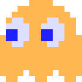

# Functional Specifications | Team 4

---

Table of Contents

- [Functional Specifications | Team 4](#functional-specifications--team-4)
  - [I. Project Overview](#i-project-overview)
  - [II. Stakeholders](#ii-stakeholders)
  - [III. Project scope](#iii-project-scope)
    - [Resource: DOSBox Emulator](#resource-dosbox-emulator)
  - [IV. Deliverables \& Milestones](#iv-deliverables--milestones)
  - [V. Personas and use cases](#v-personas-and-use-cases)
    - [Target Audience](#target-audience)
    - [1. Retro Gaming Enthusiast - Alex 🕹️](#1-retro-gaming-enthusiast---alex-️)
    - [2. Novice Player - Emily 🆕](#2-novice-player---emily-)
    - [3. Nostalgic 90s Gamer - Mike 💾](#3-nostalgic-90s-gamer---mike-)
    - [4. Tandy 1000 Enthusiast - Jason 📟](#4-tandy-1000-enthusiast---jason-)
  - [VI. Non-functional requirements](#vi-non-functional-requirements)
    - [Project expenses](#project-expenses)
      - [Time spent](#time-spent)
    - [Operational expenses](#operational-expenses)
      - [Performance](#performance)
      - [Reliability](#reliability)
      - [Security](#security)
      - [Operability](#operability)
      - [Recovery](#recovery)
      - [Maintainability](#maintainability)
  - [VII. Solution overview](#vii-solution-overview)
    - [System architecture](#system-architecture)
    - [Launch procedure](#launch-procedure)
    - [User interface](#user-interface)
    - [Game mechanics overview](#game-mechanics-overview)
      - [Winning and Losing Conditions](#winning-and-losing-conditions)
      - [Graphics](#graphics)
        - [Colors](#colors)
        - [Fonts](#fonts)
        - [Maze layout](#maze-layout)
        - [Sprites](#sprites)
        - [Animations](#animations)
      - [Sound system](#sound-system)
    - [Gameplay](#gameplay)
      - [Player Controls](#player-controls)
      - [Movement](#movement)
        - [Direction change](#direction-change)
      - [Interactions](#interactions)
        - [Pellets eating](#pellets-eating)
        - [Power Pellets](#power-pellets)
        - [Cherry](#cherry)
      - [Tunnels](#tunnels)
      - [Ghosts](#ghosts)
        - [Ghosts movements](#ghosts-movements)
        - [Behaviour modes management](#behaviour-modes-management)
        - [Blinky (Red ghost)](#blinky-red-ghost)
        - [Pinky (Pink ghost)](#pinky-pink-ghost)
        - [Inky (Blue ghost)](#inky-blue-ghost)
        - [Clyde (Orange ghost)](#clyde-orange-ghost)
        - [Frightened mode](#frightened-mode)
        - [Eaten ghosts](#eaten-ghosts)
      - [Game Rules](#game-rules)
      - [Game Over Screen](#game-over-screen)
  - [VIII. Usage example](#viii-usage-example)
  - [IX. Timeline](#ix-timeline)
  - [X. Evaluation criteria](#x-evaluation-criteria)
    - [Gameplay Requirements](#gameplay-requirements)
    - [AI and Enemy Behavior Requirements](#ai-and-enemy-behavior-requirements)
    - [Controls and Responsiveness Requirements](#controls-and-responsiveness-requirements)
    - [Graphics Requirements](#graphics-requirements)
    - [User Experience Requirements](#user-experience-requirements)
    - [Bug-Free Gameplay Requirements](#bug-free-gameplay-requirements)
  - [XI. Risks and assumptions](#xi-risks-and-assumptions)
    - [Copyright and license](#copyright-and-license)
  - [XII. Bonus/additional features](#xii-bonusadditional-features)
    - [Additional game modes](#additional-game-modes)
      - [2 players game mode](#2-players-game-mode)
        - [Specificities](#specificities)
        - [Objectives](#objectives)
        - [Key-binds](#key-binds)
      - [Ghost control game mode](#ghost-control-game-mode)
        - [Specificities](#specificities-1)
        - [Objectives](#objectives-1)
        - [Key-binds](#key-binds-1)
    - [Additional menus](#additional-menus)
      - [Main menu](#main-menu)
      - [High-score menu](#high-score-menu)
      - [Themes sub-menu](#themes-sub-menu)
    - [Additional Fruits \& Bonuses](#additional-fruits--bonuses)
    - [Game launcher](#game-launcher)
  - [XIII. Glossary](#xiii-glossary)

---

## I. Project Overview

ALGOSUP's school commissioned us to create a Pac-Man game clone in assembly x86 using DOSBox[^1]. The software's primary objective is to completely fit all the original gameplay systems.

## II. Stakeholders

| Stakeholder                             | Role & Tasks             | Description                                                                                                            | 🔗                                                 |
| --------------------------------------- | ------------------------ | ---------------------------------------------------------------------------------------------------------------------- | ------------------------------------------------- |
| ALGOSUP (represented by Franck JEANNIN) | Client                   | Client of the project                                                                                                  | [Website](https://algosup.com/)                   |
| Léo CHARTIER                            | Project Manager          | - Project management documents - Team cohesion and organisation                                                     | [Github](https://github.com/leo-chartier)         |
| Antoine PREVOST                         | Program Manager          | - Concept creation - Design decisions - Functional specifications document                                       | [Github](https://www.github.com/TechXplorerFR)    |
| Malo ARCHIMBAUD                         | Tech Lead                | - Technical decisions - Technical specifications document - Give guidelines to the developers during development | [Github](https://github.com/Malo-Archimbaud)      |
| Benoît DE KEYN                          | Junior Software Engineer | - Software development - Coding unit tests                                                                          | [Github](https://github.com/benoitdekeyn-algosup) |
| Maxime THIZEAU                          | Junior Software Engineer | - Software development - Coding unit tests                                                                          | [Github](https://github.com/MaximeTAlgosup)       |
| Maxime CARON                            | Quality Assurance        | - Writing tests plans - Test all the functionalities - Documents issues - Issue solving verification          | [Github](https://github.com/MaximeAlgosup)        |
| Thomas PLANCHARD                        | Quality Assurance        | - Writing tests plans - Test all the functionalities - Documents issues - Issue solving verification          | [Github](https://github.com/thomas-planchard)     |

## III. Project scope

The project aims to develop a faithful recreation of the classic Pac-Man game using Assembly language, within an emulated 90s computer environment. The primary objective is to deliver an experience that captures the essence of the original Pac-Man gameplay while accommodating both regular players and newcomers.

### Resource: DOSBox Emulator

To achieve the emulation of a 90s computer environment, the project will leverage the use of the DOSBox emulator. DOSBox will serve as the platform for executing and testing the Pac-Man clone, ensuring compatibility with the simulated hardware and software of the era.

## IV. Deliverables & Milestones

Here is a table of the different milestones and the deliverables dates associated:
| Date                      | Milestone / Deliverable  |
| ------------------------- | ------------------------ |
| November 13, 2023, 1.30pm | Functional specification |
| November 27, 2023, 1.30pm | Technical specification  |
| December 8, 2023, 5pm     | Test plan                |
| December 11, 2023, 5pm    | Working prototype        |
| December 21, 2023, 5pm    | Final product            |

## V. Personas and use cases

### Target Audience

The game is designed to cater to a wide range of players, from those well-acquainted with the original Pac-Man to individuals who may be discovering the game for the first time.  
The following personas are based on the target audience we assume to have.

### 1. Retro Gaming Enthusiast - Alex 🕹️

- Goals:
  - Alex's primary goal is to experience a faithful recreation of the original Pac-Man game. He is looking for a challenge that closely mirrors the difficulty level of the original arcade version.
  - He wants to relive the nostalgia of playing Pac-Man and appreciate the game's classic gameplay mechanics.

- Challenges:
  - Ensuring that the game's difficulty level closely matches that of the original Pac-Man can be a challenge, as it requires fine-tuning various gameplay elements.
  - Meeting the expectations of a dedicated retro gaming enthusiast like Alex, who may have a deep understanding and appreciation for the nuances of the original game.

### 2. Novice Player - Emily 🆕

- Goals:
  - Emily is interested in discovering and learning how to play Pac-Man for the first time. She wants an accessible experience that doesn't overwhelm her with complexity.
  - Her goal is to have fun while playing and potentially develop an interest in classic arcade games.

- Challenges:
  - Designing the game to be accessible and user-friendly for a novice player like Emily, while still maintaining the essence and challenge of Pac-Man.
  - Balancing the game's difficulty so that it provides a satisfying challenge without becoming frustrating for someone new to the game.

### 3. Nostalgic 90s Gamer - Mike 💾

- Goals:
  - Mike's main goal is to recapture the magic of the 90s arcade experience on his modern machine. He seeks an authentic recreation of Pac-Man.

- Challenges:
  - Ensuring that the Pac-Man clone provides a seamless and enjoyable experience on Mike's new machine, taking into account any hardware or software compatibility issues.
  - Striking the right balance between preserving the retro charm of the original game and incorporating modern elements to enhance the overall gaming experience for Mike.

### 4. Tandy 1000 Enthusiast - Jason 📟

- Goals:
  - Jason's primary goal is to experience Pac-Man on his Tandy 1000[^2], as it's a system he holds dear to his heart.
  - He seeks a version of Pac-Man that is optimized for the Tandy 1000's hardware and provides an authentic 80s computing experience.

- Challenges:
  - Ensuring that the Pac-Man clone is compatible with the Tandy 1000's specific hardware configurations and limitations.
  - Fine-tuning the game's performance to run smoothly on the Tandy 1000, taking into account any potential resource constraints.

## VI. Non-functional requirements

### Project expenses

#### Time spent

- We estimated the realization of such a project will require 400 manhours to complete.

### Operational expenses

#### Performance

- **Response time:**

  - The response time between a key is pressed by a user and the action taken into account by the program should be under or equal to 100 milliseconds.

- **Framerate:**

  - At least 24 frame per second, but to guarantee a smoother user-experience, our game should refresh at a 60 hertz framerate.

#### Reliability

- **Bug presence:**

  - The game should not contain bugs which are impacting the user-experience.

- **Crash presence:**

  - The game should not crash as any crash cancels the current game and inherently destroys the user experience.

#### Security

- **Network:**

  - The game will not be using the network and the program will be contained in DOSBox emulator.

#### Operability

- **Supported platforms:**

  - The game should run on any platform compatible with DOSBox emulator.

#### Recovery

- **Game crash handling:**

  - The game should restart from the beginning in case of a crash.

- **High score:**

  - Stored in an external .txt file which reloads in case of a crash.

#### Maintainability

- The code can be maintained with the provided documents in the Github repository.

## VII. Solution overview

### System architecture

As requested by ALGOSUP, we are going to use DOSBox, an emulator for the Intel 80386 family of CPUs. This software is cross-platform and does not require any DOS distribution or an x86 architecture CPU, so it can be run both on MacOS and Windows.  
Our game will be based on a 16-bit address bus, limiting addressable RAM to 65,536 bytes.

### Launch procedure

The user will have to download the latest release files and follow the installation steps which will be described in the README. The user will launch the compiled program, which is executed on the same platform, thanks to the DOSBox emulator.
We do not plan to create the launcher for the moment, so the user will have to type the different commands to launch the game contained in the README file in the DOSBox command line.

### User interface

As we plan to have an easy-to-use and intuitive interface, we want it to be as simple as possible, only showing the score, the maze, and the elements present in it. The interface will be displayed using the original ratio of Pac-Man's game: 224 pixels in width and 288 pixels in height. We are going to call a tile a 8 x 8 pixels square, so inherently, when we divide by eight each value, it yields a grid which is 28 x 36 in size.

The interface and tiles placing will look as follows:

### Game mechanics overview

As we need to respect the original gameplay rules, we have to be focused on many aspects during development:

- **Graphics**: This includes sprites for both Pac-Man and ghosts, as well as map elements such as walls, pallets, and bonus fruits.
- **Map creation and gestion**: This includes creating a map, managing pellets (small dots) and fruit cycles, as well as other hazards on the map.
- **Gameplay**: This includes moving, life system, score system, and changes between levels.
- **Moving**: This includes both Pac-Man and ghosts' moves and collisions.
- **Sound**: This includes music and sound effects.
- **Score**: This includes score storing and keeping high scores.

#### Winning and Losing Conditions

- **Winning:**
  - The player must successfully navigate the maze, consuming all of the pellets while strategically using power pellets (which are big dots) to temporarily gain the ability to eat ghosts. This process continues through multiple levels, with the ultimate goal of achieving the highest possible score and clearing all the levels. There is no theorical end to the game, so the player should manage to go as far as possible in the game levels.
- **Losing:**
  - Pac-Man loses a life if it collides with a ghost without the effects of a power pellet. The game ends if all lives are depleted.

#### Graphics

##### Colors

As Pac-Man is an 8-bit color-like game, we must adopt a similar style. The original Pac-Man game uses 16 colors, which means the colors could be coded on only 4 bits. However, the colors would be inaccurate as some red, green, and blue components are not always multiples of 16, leading us to use 8 bits to code the color space of our Pac-Man clone.

Here is the color palette we are going to use:

| Swatch                                               | Color  | 24-bit RGB    | Uses                                                        |
| ---------------------------------------------------- | ------ | ------------- | ----------------------------------------------------------- |
|   | Black  | 0, 0, 0       | Background                                                  |
|     | Red    | 252, 0, 0     | Blinky, cherry, strawberry, apple, Galaxian ship            |
|   | Brown  | 216, 144, 85  | Orange top, cherry stream                                   |
|    | Pink   | 252, 180, 255 | Pinky, ghost house door                                     |
|   | Black  | 0, 0, 0       | Background                                                  |
|    | Cyan   | 0, 252, 255   | Inky, player text                                           |
|    | Blue   | 72, 180, 255  | Key top, bell bottom                                        |
|  | Orange | 252, 180, 85  | Clyde, orange                                               |
|   | Black  | 0, 0, 0       | Background                                                  |
|  | Yellow | 252, 252, 0   | Pac-man, ready!, bell, Galaxian ship                        |
|   | Black  | 0, 0, 0       | Background                                                  |
|  | Indigo | 36, 36, 255   | Maze walls, flashings ghosts, ghost pupils, Galaxian ship   |
|   | Green  | 0, 252, 0     | Melon, strawberry top, orange leaf                          |
|    | Teal   | 72, 180, 170  | Melon wrinkles and stem                                     |
|  | Salmon | 252, 180, 170 | Dots, ghost body, ghost face when flashing                  |
|   | White  | 252, 252, 255 | Flashing ghosts, scores, text, ghost eyes, fruit highlights |

##### Fonts

We will be using the [Emulogic font](https://www.urbanfonts.com/fonts/Emulogic.htm) designs which fatifully reproduce original Pac-Man texts. Every text is displayed with a font size of 7 pixels, equivalent to a 7/8th of a tile.

##### Maze layout

The game will take place in a maze similar to the example displayed below with a width of 224 pixels and a height of 288 pixels. It will be displayed in the command line window of the DOSBox emulator. This window will be displayed in full screen.

##### Sprites

Here are the different sprites that will be used to create the game:

| Name          | Dimensions | Pictures                                      |
| ------------- | ---------- | --------------------------------------------- |
| Pac-Man       | 16x8       |            |
| Pellets       | 8x8        |            |
| Ghosts        | 16x8       |              |
| Scared Ghosts | 16x8       |  |
| Eyes          | 5x5        |                  |
| Cherry        | 8x8        |              |
| Scores        | 7x5        |      |

Pac-Man will be able to face 4 directions, up, left, down, and right, and open his mouth.  
Ghosts will be able to see in those 4 directions.

At the start of each level, the map will be similar to this

##### Animations

- **Pac-Man base animation:**

Pac-Man animations are based on the display of three Pac-Man sprites to give the impression Pac-Man is eating while moving. Each face is associated to a time described in the following table:

| Frame name        | Displayed Pac-Man                                                        | Time displayed   |
| ----------------- | ------------------------------------------------------------------------ | ---------------- |
| Opened mouth      |            | 200 milliseconds |
| Semi-opened mouth |  | 200 milliseconds |
| Closed mouth      |                         | 200 milliseconds |

Whenever Pac-Man is in the following cases, its animations are not activated and instead display the semi-opened mouth sprite:

- Pac-Man hits a wall and is stopped without any keystroke pressed
- Pac-Man is not moving at the begining of a level and the player does not press any keystroke
- Whenever Pac-Man is being eaten by a ghost

- **Pac-Man dying animation:**

When Pac-Man dies, a death animation is triggered after 1 second, not regarding the number of lives left he has. Here is the table summarizing this animation:

| Animation sprite number | Sprite                                                       | Time displayed    |
| ----------------------- | ------------------------------------------------------------ | ----------------- |
| #1                      |  | 1/6th of a second |
| #2                      |       | 1/6th of a second |
| #3                      |       | 1/6th of a second |
| #4                      |       | 1/6th of a second |
| #5                      |       | 1/6th of a second |
| #6                      |       | 1/6th of a second |
| #7                      |       | 1/6th of a second |
| #8                      |       | 1/6th of a second |
| #9                      |       | 1/6th of a second |
| #10                     |     | 1/6th of a second |
| #11                     |     | 1/6th of a second |

After, it doesn't display pac-man sprite until the game restarts and spawn another Pac-Man if the life counter of the player was greater or equal to 1, or until a new game is relaunch after prompting the user and showing the "Game Over screen"

- **Ghosts Animations:**

When moving, the ghosts are animated, giving the impression of a seamless move to the user. It consists in only two frames per ghost, animating the bottom of the sprite. The following table summarizes the images corresponding to each ghost:

| Ghost name | Orientation | Image n°1                                                  | Image n°2                                                  |
| ---------- | ----------- | ---------------------------------------------------------- | ---------------------------------------------------------- |
| Blinky     | Left        |    |    |
| Blinky     | Right       |  |  |
| Blinky     | Up          |        |        |
| Blinky     | Down        |    |    |
| Pinky      | Left        |      |      |
| Pinky      | Right       |    |    |
| Pinky      | Up          |          |          |
| Pinky      | Down        |      |      |
| Inky       | Left        |        |        |
| Inky       | Right       |      |      |
| Inky       | Up          |            |            |
| Inky       | Down        |        |        |
| Clyde      | Left        |      |      |
| Clyde      | Right       |    |    |
| Clyde      | Up          |          |          |
| Clyde      | Down        |      |      |

- **Frightening mode ghosts animations:**

When frightened, the ghosts are not able to 

#### Sound system

To give the player a more immersive experience, we want to add a sound ambiance to our game. Here is the table that recaps the different sounds that will be implemented and the use cases they are related to.

| Sound playback link                                                                                                                      | Sound name              | Trigger event                                                                                      |
| ---------------------------------------------------------------------------------------------------------------------------------------- | ----------------------- | -------------------------------------------------------------------------------------------------- |
| <a target="_blank" href="https://benoitdk.ynh.fr/web/algosup/sounds_of_pacman/startup.html">Startup Sound</a>                            | Startup                 | Sound played at the game launch before the player starts controlling Pac-Man.                      |
| <a target="_blank" href="https://benoitdk.ynh.fr/web/algosup/sounds_of_pacman/waka_waka.html">Waka Waka Sound</a>                        | Waka waka               | Sound is played when Pac-Man eats the pellets, whatever their size is.                             |
| <a target="_blank" href="https://benoitdk.ynh.fr/web/algosup/sounds_of_pacman/power_up.html">Power Up Sound</a>                          | Power up                | Sound played after Pac-Man eats a Power pellet.                                                    |
| <a target="_blank" href="https://benoitdk.ynh.fr/web/algosup/sounds_of_pacman/eating_fruit.html">Eating Fruit Sound</a>                  | Eating fruit            | Sound played when Pac-Man eats a cherry.                                                           |
| <a target="_blank" href="https://benoitdk.ynh.fr/web/algosup/sounds_of_pacman/pacman_eats_ghost.html">Eating Ghost Sound</a>             | Eating ghost            | Sound played when Pac-Man eats a ghost.                                                            |
| <a target="_blank" href="https://benoitdk.ynh.fr/web/algosup/sounds_of_pacman/ghost_siren1.html">Ghost Siren 1 Sound</a>                 | Ghost Siren 1           | Sound played by the ghost when they are dangerous to Pac-Man (when Pac-Man is not in power mode).  |
| <a target="_blank" href="https://benoitdk.ynh.fr/web/algosup/sounds_of_pacman/ghost_siren2.html">Ghost Siren 2 Sound</a>                 | Ghost Siren 2           | Sound played by the ghost when they are not dangerous to Pac-Man (when Pac-Man is in power mode).  |
| <a target="_blank" href="https://benoitdk.ynh.fr/web/algosup/sounds_of_pacman/pacman_gets_high_score.html">High Score Sound</a>          | High Score              | Sound triggered when Pac-Man reaches the previous high-score of the game.                          |
| <a target="_blank" href="https://benoitdk.ynh.fr/web/algosup/sounds_of_pacman/ghost_back_to_base.html">Ghost soul back to base Sound</a> | Ghost soul back to base | Sound played by the ghost when they are killed and their sould is coming back to their spawnpoint. |
| <a target="_blank" href="https://benoitdk.ynh.fr/web/algosup/sounds_of_pacman/pacman_dying.html">Dying sound Link</a>                    | Dying                   | Sound played by Pac-Man when it dies.                                                              |

The list of all the sounds and their players can also be found on [this link](https://benoitdk.ynh.fr/web/algosup/sounds_of_pacman/).

---

### Gameplay

#### Player Controls

- The player will control Pac-Man using the keyboard arrow keys:
  - `Up Arrow`: Move Pac-Man upward.
  - `Down Arrow`: Move Pac-Man downward.
  - `Left Arrow`: Move Pac-Man to the left.
  - `Right Arrow`: Move Pac-Man to the right.
- The player can also exit the game:
  - `Escape`: Quit the game and close the DOSBox emulator.

---

#### Movement

Pac-Man moves through the maze at the rate of 11 pixels per second, or 11/8th of a tile. The game is rendered at, at least 24 frames per second, ensuring smooth movement for human eyes. However, we keep in mind that 60 frames per second is the targeted framerate.

##### Direction change

When Pac-Man changes direction, the sprite representing it changes in direction, here are the sprites corresponding to each directions:

| Direction | Open face sprite                                               | Semi-opened face                                                         | Closed face                                       |
| --------- | -------------------------------------------------------------- | ------------------------------------------------------------------------ | ------------------------------------------------- |
| Up        |        |        |  |
| Down      |    |    |  |
| Left      |    |    |  |
| Right     |  |  |  |

#### Interactions

##### Pellets eating

- Small dots, which are also called pellets, are strategically almost completely placed throughout the maze, as shown in the following image. When Pac-Man comes into contact with a pellet, it is immediately consumed and disappears from the screen, as well as increasing the player current game score by 10 points.

In this image, the little red dots situated in the center of the corridors of the maze are the pellets which can be eaten by Pac-Man. They are following the placing of the dots indicated in the [User interface section](#user-interface)

##### Power Pellets

- There are four power pellets located in the corners of the maze following the places indicated in the following image. When Pac-Man consumes a power pellet, it gains the ability to eat ghosts for a limited amount of time by turning them into frightened mode, as well as earning 50 points which are incremented to the player's score.

In this image, the bigger red dots situated in the center of the maze are the pellets which can be eaten by Pac-Man.

##### Cherry

- After 70 pellets have eaten, a bonus cherry appears in the maze and stays active and displayed on the screen. When Pac-Man collects the fruit, 100 additional points are awarded and incremented to the player's score. After 170 dots are eaten, another cherry will appear unless the first one is still here.

| Eaten dots | Time displayed | Given points |
| ---------- | -------------- | ------------ |
| 70         | 10s            | 100          |
| 170        | 8s             | 100          |

After eating a cherry, a text sprite indicating the player earned 100 points in Salmon color appears at the exact position where the cherry was and disappears after 2 seconds.

#### Tunnels

There are two paths (also called tunnel) in the middle of the maze, one on the left and one on the right as shown in red in the image. These paths have no border at the edge of the screen, and when Pac-Man or the ghosts take them, they teleport to the opposite side of the path. For example, if Pac-Man takes the right tunnel and hits the border, it will be teleported to the left tunnel layer by layer.

#### Ghosts

Blinky, Pinky, Inky, and Clyde are the four ghosts that roam the maze. Each ghost has a unique movement pattern based on their unique artificial intelligence and behaviour linked to it.

##### Ghosts movements

Every ghost cannot stop moving or reverse direction in all three modes of behaviour, except in some cases when the system changes the mode we are playing on execpt when getting out of frightened mode. Here are the cases when ghosts are forced by the system to change direction:

- chase-to-scatter
- chase-to-frightened
- scatter-to-chase
- scatter-to-frightened

However, they DO NOT reverse direction in the following cases:

- frightened-to-chase
- frightened-to-scatter

The ghosts have three different modes of behaviour they can be in during the game:

---

1. **CHASE:** When a ghost is in chase mode, its objective is to find and capture Pac-Man with a predefined algorithm targetting a specific tile. Each of the ghosts have their own behaviour and algorithm associated to it. Those are described further in this section.

---

2. **SCATTER:** In scatter mode, the ghosts are giving up the chase against Pac-Man for a few seconds and they head to their respective home corners, aiming for a target situated out of the maze. But, as the actual targets are not accessible and the ghosts cannot reverse direction, they have to keep going past the target, but quickly turn back to it. This ends up making each ghost's path turn into a kind of loop in their corner.

Here are the assignated corners to each of the ghost:

- **Top left corner:** Pink ghost
- **Top right corner:** Red ghost
- **Bottom left corner:** Orange ghost
- **Bottom right corner:** Blue ghost

---

3. **FRIGHTENED:** Whenever Pac-Man enters power mode after eating a power pellet, the ghost enter frightening mode. When entering into it, the ghosts revert direction and turn dark blue. When in this mode, their behaviour is controled by a pseudo-random number generator (PRNG)[^3] picking a way to turn at each intersection. Before exiting frightened mode, the ghosts will flash briefly as a warning as explained in the [Animations section](#animations)

---

##### Behaviour modes management

Ghosts switch back and forth between scatter and chase modes at set times in the levels. You can tell when this happens because all the ghosts suddenly turn around together. Scatter mode kicks in four times per level, and after that, the ghosts stick to chase mode forever. The scatter/chase timer resets when you lose a life or finish a level. When a level begins or you lose a life, the ghosts come out of the ghost pen in the first scatter mode.

The following table is showing the duration of each phase in seconds depending of the level you are playing on:

| Mode    | Level 1    | Levels 2 to 4 | Levels 5+  |
| ------- | ---------- | ------------- | ---------- |
| Scatter | 7          | 7             | 5          |
| Chase   | 20         | 20            | 20         |
| Scatter | 7          | 7             | 5          |
| Chase   | 20         | 20            | 20         |
| Scatter | 5          | 5             | 5          |
| Chase   | 20         | 1033          | 1037       |
| Scatter | 5          | 1/60          | 1/60       |
| Chase   | Indefinite | Indefinite    | Indefinite |

---

##### Blinky (Red ghost)

- **Spawn:**
  - Blinky is the only ghost spawning out of the ghost house. He starts chasing Pac-Man straight away when the player can control Pac-Man moves.
- **Speed variations:**
  - While eating the pellets across a level, the speed of Blinky is increasing as a consequence two times in the same level. Its the only ghost whose speed is not following the speed table above. The following table summarizes the evolution of the speed when the number is equal or below the one shown, compared to Pac-Man base speed, across the levels and remaining pellets to be eaten:

  | Level     | Remaining pellets (first speed increase) | Blinky's speed 1 | Remaining pellets (second speed increase) | Blinky's speed 2 |
  | --------- | ---------------------------------------- | ---------------- | ----------------------------------------- | ---------------- |
  | Level 1   | 20                                       | 80%              | 10                                        | 85%              |
  | Level 2   | 30                                       | 90%              | 15                                        | 95%              |
  | Level 3   | 40                                       | 90%              | 20                                        | 95%              |
  | Level 4   | 40                                       | 90%              | 20                                        | 95%              |
  | Level 5   | 40                                       | 100%             | 20                                        | 105%             |
  | Level 6   | 50                                       | 100%             | 25                                        | 105%             |
  | Level 7   | 50                                       | 100%             | 25                                        | 105%             |
  | Level 8   | 50                                       | 100%             | 25                                        | 105%             |
  | Level 9   | 60                                       | 100%             | 30                                        | 105%             |
  | Level 10  | 60                                       | 100%             | 30                                        | 105%             |
  | Level 11  | 60                                       | 100%             | 30                                        | 105%             |
  | Level 12  | 80                                       | 100%             | 40                                        | 105%             |
  | Level 13  | 80                                       | 100%             | 40                                        | 105%             |
  | Level 14  | 80                                       | 100%             | 40                                        | 105%             |
  | Level 15  | 100                                      | 100%             | 50                                        | 105%             |
  | Level 16  | 100                                      | 100%             | 50                                        | 105%             |
  | Level 17  | 100                                      | 100%             | 50                                        | 105%             |
  | Level 18  | 100                                      | 100%             | 50                                        | 105%             |
  | Level 19  | 120                                      | 100%             | 60                                        | 105%             |
  | Level 20+ | 120                                      | 100%             | 60                                        | 105%             |

  - If the player loses a life after being affected by at least one speed increase, Blinky will return back to its default speed until the orange ghost (Clyde) leaves the ghost house. In this case, the applied sppeed to the ghost will be the speed matching the level and remaining pellets in the maze.

- **Pac-Man targetting:**
  - When Blinky is in chase mode, he is targetting the tile where Pac-Man is currently situated, which makes it a danger in the early game.
  - If one of these speed increase already happened before a scatter mode phase, Blinky will not target the tile assignated in the upper right corner, but will instead target the tile on which Pac-Man is situated. He will still also be affected by the direction revert.

  This schema describes how Blinky targets Pac-Man:

---

##### Pinky (Pink ghost)

- **Spawn:**
  - Pinky is spawning in the ghost house and is the first one to get out of it when Blinky is no more on its horizontal spawning line.
- **Speed variations:**
  - The speed of Pinky is constant and follows the Ghost speed table across the different levels
- **Pac-Man targetting:**
  - When Pinky is in chase mode, he looks for Pac-Man position and orientation, and he targets the tile situated four tiles ahead of Pac-Man current position. This behaviour works for the right, left and down position. However, due to an overflow error, when Pac-Man faces up Pinky targets 4 tiles ahead and 4 tiles to the left of him. Even if this behaviour is unintentional, we should reproduce it to have a faithful Pac-Man clone.

Pinky's targetting in when Pac-Man faces left, right or down.

Pinky's targetting in when Pac-Man faces up.

##### Inky (Blue ghost)

- **Spawn:**
  - Inky also spawns in the ghost house and is the 2nd ghost to come out of it. It spawns on the left part of the house, allowing Pinky which is situated in the center to exit it before itself. However, it cannot come out of it while Pac-Man has not eaten 30 pellets yet.
- **Speed variations:**
  - The speed of Pinky is constant and follows the Ghost speed table across the different levels
- **Pac-Man targetting:**
  - In chase mode, Inky uses the most diffuclt targetting scheme. He needs Pac-Man's current tile and orientation and Bliky's current tile. First, you have to take the tile situated two tiles ahead of Pac-Man, considering his current direction. You then imagine a vector from Blinky's current tile to the tile situated 2 tiles ahead of Pac-Man. Finally, you multiply by 2 the length of this vector, and the end of it will show the targetted tile by Inky.

##### Clyde (Orange ghost)

- **Spawn:**
  - Clyde spawns in the right part of the ghost house and is the last one to get out of it. It does not come out until at least one thrid of all the pellets have been eaten by Pac-Man.
- **Speed variations:**
  - The speed of Pinky is constant and follows the Ghost speed table across the different levels
- **Pac-Man targetting:**
  - Clyde has two modes which it constantly switches back and forth depending on its distance to Pac-Man.
  
| Distance to Pac-Man using the most efficient path | Behaviour                                                                                                    |
| ------------------------------------------------- | ------------------------------------------------------------------------------------------------------------ |
| > 8 tiles                                         | Uses the same targetting as Blinky in chase mode                                                             |
| <= 8 tiles                                        | Clyde targets the tile he targets when in scatter mode, which is the one situated in the bottom left corner. |

In this case, Clyde, is less than 8 tiles away from Pac-Man, so it needs to target the tile situated in the bottom left corner.

As Pac-Man is more than eight tiles away using the most efficient path, Clyde restarts chasing him.

##### Frightened mode

- If Pac-Man collides with a ghost while not under the effects of a power pellet, Pac-Man loses a life.
  - If a power pellet has been eaten by Pac-Man, ghosts are frightened during the time Pac-Man is in power mode and subsequently, the time when the ghosts are vulnerable. This time decreases the further you are in the levels:
  
  | Level        | Duration of the ghosts frightening (in seconds) |
  | ------------ | ----------------------------------------------- |
  | 1            | 6                                               |
  | 2            | 5                                               |
  | 3            | 4                                               |
  | 4            | 3                                               |
  | 5            | 2                                               |
  | 6            | 5                                               |
  | 7 and 8      | 2                                               |
  | 9            | 1                                               |
  | 10           | 5                                               |
  | 11           | 2                                               |
  | 12 and 13    | 1                                               |
  | 14           | 3                                               |
  | 15 and 16    | 1                                               |
  | 17           | 0                                               |
  | 18           | 1                                               |
  | 19 and after | 0                                               |

##### Eaten ghosts

If a ghost is being eaten by Pac-Man, its sprite disappears except its eyes which are coming back to the ghost house following the maze layout. Once at their spawn point, their sprite reappears in the ghost box.

Here are the different eye sprites corresponding to the direction they are travelling to:

| Eyes direction | Sprite                                    |
| -------------- | ----------------------------------------- |
| Up             |        |
| Down           |    |
| Left           |    |
| Right          |  |

#### Game Rules

- **Scoring:**
  | Object eaten  | Point values |
  | ------------- | ------------ |
  | Pellets       | 10 points    |
  | Power pellets | 50 points    |
  | Cherry        | 100 points   |
  | 1 Ghost       | 200 points   |
  | 2 Ghosts \*   | 400 points   |
  | 3 Ghosts \*   | 800 points   |
  | 4 Ghosts \*   | 1600 points  |

  \* The "2 Ghosts", "3 Ghosts" and "4 Ghosts" point values are only valid if the ghosts are eaten consecutively during the same frightening mode session.
- **Level Progression:**
  - Each level starts with the same maze layout. The difficulty increases as players progress through levels with faster ghosts.
- **Extra Lives:**
  - Pac-Man starts with three lives. An extra life is awarded upon reaching 10,000 points, however, the player cannot have more than 5 lives counting the one on which the player is playing.

#### Game Over Screen

When the game ends as the player dies and has no more lives, the player is presented with a game over screen displaying the text "Game Over", along with options to restart or quit.

## VIII. Usage example

We expect our software to be used for entertainment purposes, whether the user is nostalgic about the time this game was just released or just wants to discover the retro-games environment.

Here is an activity diagram showing the potential usage of our software and the timeline the user could go through :

## IX. Timeline

- Planning & Research
  - Learning about the project and preparing for it
  - Week 1 & 2
  - 5 half days
- Main display & Mechanics
  - Displaying the player, maze, and movement maze collision and eating pellets
  - Week 3 & 4
  - 6 half days
- Complex display & Mechanics
  - Working ghosts, fruits, score, and live system
  - Week 5
  - 3 half days
- Polishing
  - Adding sounds, animations, level system, ...
  - Week 6
  - 4 half days
- Reserve time & pitch preparation
  - Time reserved in case of problems and preparing a presentation to the client
  - Week 7
  - 7 half days

The complete timeline and tasks can be found in the [Management section](https://github.com/algosup/2023-2024-project-2-x86-retrogaming-team-4/tree/main/documents/management).

## X. Evaluation criteria

To assess the performance and quality of the project, a set of evaluation criteria has been established. These criteria serve as benchmarks against which the project's functionality, design, and overall execution will be measured. The evaluation process aims to ensure that the final product meets the specified objectives. Below are the key areas of focus that will be considered during the evaluation.

### Gameplay Requirements

- **Movement and Responsiveness:** The sprites' movement speed must be at least 24 pixels per second. Player inputs for movement must result in immediate and responsive character actions.

- **Winning and Losing Conditions:** Winning the game should be achieved by consuming all the dots within a level. Losing conditions must be triggered when Pac-Man either exhausts all lives or is captured by an enemy.

- **Level Progression:** The game must feature progressively challenging levels. Initial levels should include slow and not very intelligent enemies, while later levels should introduce more intelligent and faster enemies.

### AI and Enemy Behavior Requirements

- **Enemies Intelligence:** Enemies should exhibit intelligent behavior, using pathfinding algorithms to pursue Pac-Man logically. Their movements should dynamically respond to Pac-Man's position.

- **Fairness and Challenge:** Strive to maintain a balanced and challenging gameplay experience. Enemies should be swift and pose a challenge without causing undue frustration for the player.

- **Ghosts being eaten:** When a ghost is being eaten by Pac-Man in power mode, it is warped back to its spawn point which is situated in a cage in the center of the maze.

### Controls and Responsiveness Requirements

- **Control Response Time:** The game should acknowledge player inputs with minimal delay. Specifically, key presses must be recognized within 50 milliseconds of being executed.

### Graphics Requirements

- **Visual Quality:** Visual elements, including character sprites, animations, and maze designs, should be visually appealing and run smoothly. There should be no graphical glitches during gameplay.

### User Experience Requirements

- **Menu and Transitions:** Menu transitions and animations must provide a seamless user experience. Transitions between menus and screens should not exceed 200 milliseconds to ensure a fluid feel.

- **Replay Value:** Encourage replayability through features such as high-score tracking and the inclusion of hidden bonuses within mazes, motivating players to revisit levels.

### Bug-Free Gameplay Requirements

- **Collision Detection:** The game should undergo rigorous testing to ensure it is entirely free from gameplay bugs. Specifically, collisions between Pac-Man and enemies must be detected accurately without any hitbox discrepancies.

## XI. Risks and assumptions

|       Risk       | Impact                                                                                                                                                                                                                                                                                                                                                                                   | Mitigation                                                                                                                                                                                                                                                                                                                |
| :--------------: | :--------------------------------------------------------------------------------------------------------------------------------------------------------------------------------------------------------------------------------------------------------------------------------------------------------------------------------------------------------------------------------------- | :------------------------------------------------------------------------------------------------------------------------------------------------------------------------------------------------------------------------------------------------------------------------------------------------------------------------ |
|   Scope creep    | We might try to make the project too big which could lead to the project running out of time.                                                                                                                                                                                                                                                                                            | We must plan our work by doing a breakdown of the different tasks in sub-tasks and estimate a specific time which will be dedicated to this sub-task realisation.                                                                                                                                                         |
| Technical issues | Assembly, which is the language used during this project, is part of a niche for development as only a few software developers are still using this low-level language.  This explains why only a few people is our team already know how to code in depth with it. For this reason, many bugs or crashes could happen during the project realisation, mainly caused by memory leaks. | These unexpected behaviour must be found and patched as reliability and user friendliness are the key-points of a non-necessary software such as a video-game to keep users interested.  However, patching behaviour issues might be challenging as we may encounter errors which have not been previously documented. |

### Copyright and license

As Pac-Man is still under license, we had to take into consideration the fact that it could be an issue. After asking the client, they told us this should not be an issue for several reasons, but advised us to reach out directly to Bandai Namco Entertainment Inc.[^4]. We sent an email to them, and received an answer, saying there could not give an explicit approval for us to use their product in our project. The only piece of advide they could give us was to make sure everything we ere doing was falling in the relevant legal framework. As a consequence, we decided to take the following measures:

- Include in the first line of the README a reference to the non-commercial usage of the software, as it was only made with educational and entertainment purpose.
- Include a Creative Commons BY-NC license which restrcits to non-commercial and personal usages only. This license limits the usage of the software, as well as clearing our names from violating a copyright.
- Explicitly say we are not the authors of the original Pac-Man game and we only pay a tribute to the original Pac-Man in the README.
- With these actions, we can leave the GitHub repository publicly accessible to anyone.

## XII. Bonus/additional features

As a bonus which will be added if we don't face any issues during the development and testing phases, we plan to add some additional features to give players more varied experiences in terms of gameplay.  

### Additional game modes

#### 2 players game mode

This game mode can be played by two players at the same time. Both players control their own Pac-Man sprite on the same keyboard. The objective of this game mode is strictly the same as the original Pac-Man game. The second character is wearing a hair bow and is called "Miss Pac-Man".

##### Specificities

- Each Pac-Man has independent movements and is controlled separately from the other.
- Loot tables stay the same compared to the one specified in the [Game Rules](#game-rules)
- If Pac-man and Miss Pac-Man collide during the game, each of them loses a life and is brought back to their spawn point, but the emplacement of the ghosts and the already-eaten dots are not reset.

##### Objectives

The objective of this game mode is similar to the one-player original Pac-Man game mode, you have to progress across different levels, going as far as you can, by eating all the dots and trying to avoid being eaten by the ghosts, except when the phantoms are flashing in blue, which is the moment when you can eat them to gain more points.

##### Key-binds

All controls described in the following section are assumed to be done using an **AZERTY** layout keyboard:

- First player moves:
  - `Up Arrow`: Move the Pac-Man sprite without a hair bow upward.
  - `Down Arrow`: Move the Pac-Man sprite Pac-Man without a hair bow downward.
  - `Left Arrow`: Move the Pac-Man sprite Pac-Man without a hair bow to the left.
  - `Right Arrow`: Move the Pac-Man sprite Pac-Man without a hair bow to the right.
- Second player moves:
  - `Z`: Move the Pac-Man sprite without a hair bow upward.
  - `S`: Move the Pac-Man sprite Pac-Man without a hair bow downward.
  - `Q`: Move the Pac-Man sprite Pac-Man without a hair bow to the left.
  - `D`: Move the Pac-Man sprite Pac-Man without a hair bow to the right.
- `Escape`: Quit the game and close the DOSBox emulator.

#### Ghost control game mode

This game mode can be only played by one player. In this game mode, instead of controlling Pac-Man, the player controls the ghosts which are normally chasing him. They may only control one at a time but can switch between them.

##### Specificities

- Each ghost is controlled independently from the others.
- The player can switch from one ghost to the other with attributed key-binds.
- Each ghost has independent lives but a maximum of 3 per level.
- While a ghost is not selected, the artificial intelligence normally guiding him retakes its control.

##### Objectives

The main objective of this game mode is to stop Pac-Man as early as possible in the levels. It is mainly challenging as you have to completely think of how you can stop him as quickly as possible instead of how to go as far as possible in the game.

##### Key-binds

- `&` key: Switch to Blinky's moves control
  - Pressing the `&` key when Blinky is already the sprite whose moves are already controlled does nothing
- `é` key: Switch to Pinky's moves control
  - Pressing the `é` key when Pinky is already the sprite whose moves are already controlled does nothing
- `"` key: Switch to Inky's moves control
  - Pressing the `"` key when Inky is already the sprite whose moves are already controlled does nothing
- `'` key: Switch to Inky's moves control
  - Pressing the `'` key when Inky is already the sprite whose moves are already controlled does nothing
- `Up Arrow`: Move the controlled ghost sprite upward.
- `Down Arrow`: Move the controlled ghost sprite downward.  
- `Left Arrow`: Move the controlled ghost sprite to the left.
- `Right Arrow`: Move the controlled ghost sprite to the right.
- `Escape`: Quit the game and close the DOSBox emulator.

### Additional menus

#### Main menu

This menu will allow the player to navigate between the different available game modes and menus of the final Pac-Man game which will be available. This menu will be composed of the different options being aligned vertically in the center of the screen.

The controls in this menu will be the following:

- `Up Arrow`: Select the upward option.
  - When on the top option, pressing this key does not warp to the bottom one, instead does nothing.
- `Down Arrow`: Select the downward option.
  - When on the bottom option, pressing this key does not warp to the bottom, instead does nothing.
- `Enter key`/`Spacebar`: Choose this option and enter the sub-menu associated with it.
- `Escape`: Quit the game and close the DOSBox emulator.

#### High-score menu

This menu will be read-only and will consist of reading the highest scores which have been done by playing our game in each of the game modes. At the bottom of the menu, there will be a button to escape this menu and go back to the main menu.

The controls in this menu will be the following:

- `Enter key`/`Spacebar`: Go back to the main menu.
- `Escape`: Quit the game and close the DOSBox emulator.

#### Themes sub-menu

This menu will allow you to choose between different gameplay styles, changing the color palette of the game, the sprites and Pac-Man sprites as well as the maze layout.

<!-- To finish (create interface & explain) -->

- `Left Arrow`: Select the sub-option situated on the left.
  - When on the leftmost option, pressing this key does not warp to the rightmost sub-option of this option or the previous option's rightmost sub-option, instead does nothing.
- `Right Arrow`: Select the sub-option situated on the right.
  - When on the rightmost option, pressing this key does not warp to the leftmost sub-option of this option or the previous option's leftmost sub-option, instead does nothing.
- `Down Arrow`: Select the first sub-option of the lower option.
  - When on the bottom option, pressing this key does not warp to the top option, instead does nothing.
- `Up Arrow`: Select the first sub-option of the upper option.
  - When on the top option, pressing this key does not warp to the bottom option, instead does nothing.
- `Enter key`/`Spacebar`: Choose and apply the sub-option of an option.
  - When selecting a sub-option of an option, it unselects the previously selected option.

### Additional Fruits & Bonuses

As the cherry is the most iconic fruit of the Pac-Man game, we decided to implement it directly, however, we plan to add the other fruits present in it. Each of them will be displayed as an 8x8 sprite in the maze and will be randomly spawning with a decreasing spawn rate the more the fruit gives points. They are subjected to the same spawn conditions as the one described in the [interactions section](#interactions).  
Here is the table of the bonus points provided by the bonus fruits and the spawn rate associated with it:

| Image                                              | Fruit name        | Given points |
| -------------------------------------------------- | ----------------- | ------------ |
|       | Strawberry        | 300          |
|               | Orange            | 500          |
|                 | Apple             | 700          |
|                 | Melon             | 1000         |
|  | Galaxian starship | 2000         |
|                   | Bell              | 3000         |
|                     | Key               | 5000         |

### Game launcher

As executing an x86 ASM file using DOSBox is a fastidious task for inexperienced users, we plan to create a .exe and a .dmg executable to launch our Pac-Man clone if we don't face any development issues before the project deadline. It will automatically check if DOSBox is installed or not. If not, it will download and install DOSBox before launching the game automatically in both cases. However, as this is a complex task that needs a complete breakdown of the feature, we are going to create another functional and technical specification for this.

## XIII. Glossary

[^1]: DOSBox is an emulator program that emulates an IBM PC-compatible computer running a DOS operating system.

[^2]: The Tandy 1000 was the first in a line of IBM PC-compatible home computer systems produced by the Tandy. The Tandy 1000 is powered by an x86 processor operating on a 16-bit architecture. This means that it utilizes the Intel 8088, which is a 16-bit microprocessor compatible with the x86 instruction set.

[^3]: A pseudo-random number generator (PRNG) generates an pseudo-random memory address to read the last few bits from. If the value generated is not valid, it keeps regenerating it.

[^4]: Bandai Namco Entertainment Inc. is a Japanese multinational video game publisher that owns Pac-Man's property.
