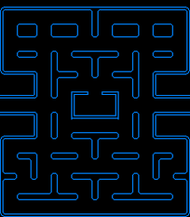
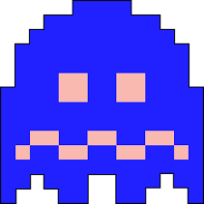

# Functional Specifications | Team 4

---
|                 |                  |
| --------------- | ---------------- |
| Document name   | Functional specifications  |
| Document owner  | Antoine PREVOST  |
| Creation date   | November 6, 2023 |
| Lastest version | November 12, 2023 |

Table of Contents

- [Functional Specifications | Team 4](#functional-specifications--team-4)
  - [Project Overview](#project-overview)
  - [Stakeholders](#stakeholders)
  - [Project scope](#project-scope)
    - [Resource: DOSBox Emulator](#resource-dosbox-emulator)
  - [Deliverables \& Milestones](#deliverables--milestones)
  - [Personas and use cases](#personas-and-use-cases)
    - [Target Audience](#target-audience)
    - [1. Retro Gaming Enthusiast - Alex 🕹️](#1-retro-gaming-enthusiast---alex-️)
    - [2. Novice Player - Emily 🆕](#2-novice-player---emily-)
    - [3. Nostalgic 90s Gamer - Mike 💾](#3-nostalgic-90s-gamer---mike-)
    - [4. Tandy 1000 Enthusiast - Jason 📟](#4-tandy-1000-enthusiast---jason-)
  - [Solution overview](#solution-overview)
    - [System architecture](#system-architecture)
    - [User interface](#user-interface)
    - [Game mechanics overview](#game-mechanics-overview)
      - [Winning and Losing Conditions](#winning-and-losing-conditions)
      - [Graphics](#graphics)
        - [Colors](#colors)
        - [Game window](#game-window)
        - [Sprites](#sprites)
      - [Sound system](#sound-system)
    - [Gameplay](#gameplay)
      - [Player Controls](#player-controls)
      - [Movement](#movement)
      - [Interactions](#interactions)
      - [Game Rules](#game-rules)
      - [Game Over Screen](#game-over-screen)
  - [Example applications](#example-applications)
  - [Timeline](#timeline)
  - [Evaluation criteria](#evaluation-criteria)
    - [Gameplay Requirements](#gameplay-requirements)
    - [AI and Enemy Behavior Requirements](#ai-and-enemy-behavior-requirements)
    - [Controls and Responsiveness Requirements](#controls-and-responsiveness-requirements)
    - [Graphics Requirements](#graphics-requirements)
    - [User Experience Requirements](#user-experience-requirements)
    - [Bug-Free Gameplay Requirements](#bug-free-gameplay-requirements)
  - [Risks and assumptions](#risks-and-assumptions)
    - [Copyright and license](#copyright-and-license)
  - [Bonus/additional features](#bonusadditional-features)
    - [Additional game modes](#additional-game-modes)
      - [2 players game mode](#2-players-game-mode)
        - [Specificities](#specificities)
        - [Objectives](#objectives)
        - [Key-binds](#key-binds)
      - [Ghost control game mode](#ghost-control-game-mode)
        - [Specificities](#specificities-1)
        - [Objectives](#objectives-1)
        - [Key-binds](#key-binds-1)
    - [Additional menus](#additional-menus)
      - [Main menu](#main-menu)
      - [High-score menu](#high-score-menu)
    - [Additional Fruits \& Bonuses](#additional-fruits--bonuses)
    - [Game launcher](#game-launcher)
  - [Glossary](#glossary)

---

## Project Overview

ALGOSUP's school commissioned us to create a Pac-Man game clone in assembly x86 using DOSBox[^1]. The software's primary objective is to completely fit all the original gameplay systems.

## Stakeholders

| Stakeholder      | Role                     | Description                        | 🔗                                            |
| ---------------- | ------------------------ | ---------------------------------- | ---------------------------------------------- |
| ALGOSUP          | Client                   | Client of this project.            | [Website](https://algosup.com/)                |
| Léo CHARTIER     | Project Manager          | In charge of project management.   | [Github](https://github.com/leo-chartier)      |
| Antoine PREVOST  | Program Manager          | In charge of program management.   | [Github](https://www.github.com/TechXplorerFR) |
| Malo ARCHIMBAUD  | Tech Lead                | In charge of technical aspects.    | [Github](https://github.com/Malo-Archimbaud)   |
| Benoît DE KEYN   | Junior Software Engineer | In charge of software development. | [Github](https://github.com/benoitdekeyn-algosup)              |
| Maxime THIZEAU   | Junior Software Engineer | In charge of software development. | [Github](https://github.com/MaximeTAlgosup)    |
| Maxime CARON     | Quality Assurance        | In charge of project quality.      | [Github](https://github.com/MaximeAlgosup)     |
| Thomas PLANCHARD | Quality Assurance        | In charge of project quality.      | [Github](https://github.com/thomas-planchard)  |

## Project scope

The project aims to develop a faithful recreation of the classic Pac-Man game using Assembly language, within an emulated 90s computer environment. The primary objective is to deliver an experience that captures the essence of the original Pac-Man gameplay while accommodating both regular players and newcomers.

### Resource: DOSBox Emulator

To achieve the emulation of a 90s computer environment, the project will leverage the use of the DOSBox emulator. DOSBox will serve as the platform for executing and testing the Pac-Man clone, ensuring compatibility with the simulated hardware and software of the era.

## Deliverables & Milestones

Here is a table of milestones and deliverables dates:
| Date    | Milestone / Deliverable       |
| ------------------ |-------------------- |
| November 13, 2023, 1.30pm|  Functional specification    |
| November 27, 2023, 5pm    | Technical specification  |
| December 8, 2023, 5pm   | Test plan  |
| December 11, 2023, 5pm   | Working prototype  |
| December 21, 2023, 5pm   | Final product  |

## Personas and use cases

### Target Audience

The game is designed to cater to a wide range of players, from those well-acquainted with the original Pac-Man to individuals who may be discovering the game for the first time.
The following personas are based on the target audience we assume to have.

### 1. Retro Gaming Enthusiast - Alex 🕹️

- Goals:
  - Alex's primary goal is to experience a faithful recreation of the original Pac-Man game. He is looking for a challenge that closely mirrors the difficulty level of the original arcade version.
  - He wants to relive the nostalgia of playing Pac-Man and appreciate the game's classic gameplay mechanics.

- Challenges:
  - Ensuring that the game's difficulty level closely matches that of the original Pac-Man can be a challenge, as it requires fine-tuning various gameplay elements.
  - Meeting the expectations of a dedicated retro gaming enthusiast like Alex, who may have a deep understanding and appreciation for the nuances of the original game.

### 2. Novice Player - Emily 🆕

- Goals:
  - Emily is interested in discovering and learning how to play Pac-Man for the first time. She wants an accessible experience that doesn't overwhelm her with complexity.
  - Her goal is to have fun while playing and potentially develop an interest in classic arcade games.

- Challenges:
  - Designing the game to be accessible and user-friendly for a novice player like Emily, while still maintaining the essence and challenge of Pac-Man.
  - Balancing the game's difficulty so that it provides a satisfying challenge without becoming frustrating for someone new to the game.

### 3. Nostalgic 90s Gamer - Mike 💾

- Goals:
  - Mike's main goal is to recapture the magic of the 90s arcade experience on his modern machine. He seeks an authentic recreation of Pac-Man.

- Challenges:
  - Ensuring that the Pac-Man clone provides a seamless and enjoyable experience on Mike's new machine, taking into account any hardware or software compatibility issues.
  - Striking the right balance between preserving the retro charm of the original game and incorporating modern elements to enhance the overall gaming experience for Mike.

### 4. Tandy 1000 Enthusiast - Jason 📟

- Goals:
  - Jason's primary goal is to experience Pac-Man on his Tandy 1000[^2], as it's a system he holds dear to his heart.
  - He seeks a version of Pac-Man that is optimized for the Tandy 1000's hardware and provides an authentic 80s computing experience.

- Challenges:
  - Ensuring that the Pac-Man clone is compatible with the Tandy 1000's specific hardware configurations and limitations.
  - Fine-tuning the game's performance to run smoothly on the Tandy 1000, taking into account any potential resource constraints.

## Solution overview

### System architecture

As requested by ALGOSUP, we are going to use DOSBox, an emulator for Intel 80386 family CPUs. This software is cross-platform and does not require any DOS distribution or an x86 architecture CPU, so it can be run both on MacOS and Windows.
Our game will be based on a 16-bit address bus, limiting addressable RAM to 65,536 bytes.

### User interface

As we plan to have an easy-to-use and intuitive interface, we want it to be as simple as possible, only showing the score, the maze, and the elements present in it.

The interface will look as follows (the maze layout is subject to edits):

### Game mechanics overview

As we need to respect the original gameplay rules, we have to be focused on many aspects during development:

- **Graphics**: This includes sprites for both Pac-Man and ghosts, as well as map elements such as walls, pallets, and bonus fruits.
- **Map creation and gestion**: This includes creating a map, managing pellets and fruit cycles, as well as other hazards on the map.
- **Gameplay**: This includes moving, life system, score system, and changes between levels.
- **Moving**: This includes both Pac-Man and ghosts' moves and collisions.
- **Sound**: This includes music and sound effects.
- **Score**: This includes score storing and keeping high scores.

#### Winning and Losing Conditions

- **Winning:**
  - The player must successfully navigate the maze, consuming all of the small dots (pellets) while strategically using power pellets (which are bigger dots) to temporarily gain the ability to eat ghosts. This process continues through multiple levels, with the ultimate goal of achieving the highest possible score and clearing all the levels.
- **Losing:**
  - Pac-Man loses a life if it collides with a ghost without the effects of a power pellet. The game ends if all lives are depleted.

#### Graphics

##### Colors

As Pac-Man is an 8-bit color-like game, we must adopt a similar style. The original Pac-Man game uses 16 colors, which means the colors could be coded on only 4 bits. However, the colors would be inaccurate as some red, green, and blue components are not always multiples of 16, leading us to use 8 bits to code the color space of our Pac-Man clone.

Here is the color palette we are going to use:

|Swatch|Color|24-bit RGB|Uses|
| --- | --- | --- | --- |
||Black|0, 0, 0|Background|
||Red|252, 0, 0|Blinky, cherry, strawberry, apple, Galaxian ship|
||Brown|216, 144, 85|Orange top, cherry stream|
||Pink|252, 180, 255|Pinky, ghost house door|
||Black|0, 0, 0|Background|
||Cyan|0, 252, 255|Inky, player text|
||Blue|72, 180, 255|Key top, bell bottom|
||Orange|252, 180, 85|Clyde, orange|
||Black|0, 0, 0|Background|
||Yellow|252, 252, 0|Pac-man, ready!, bell, Galaxian ship|
||Black|0, 0, 0|Background|
||Indigo|36, 36, 255|Maze walls, flashings ghosts, ghost pupils, Galaxian ship|
||Green|0, 252, 0|Melon, strawberry top, orange leaf|
||Teal|72, 180, 170|Melon wrinkles and stem|
||Salmon|252, 180, 170|Dots, ghost body, ghost face when flashing|
||White|252, 252, 255|Flashing ghosts, scores, text, ghost eyes, fruit highlights|

##### Game window

The game will take place in a maze similar to the example displayed below. Of course, the maze's shape, size, or layout might be changed compared to this one. It will be displayed in the command line window of the DOSBox emulator. This window will be displayed in full screen.

##### Sprites

Here are the different sprites that will be used to create the game:

|Name|Dimensions|Pictures|
| --- | --- | --- |
|Pac-Man|16x8||
|Pellets|8x8||
|Ghosts|16x8||
|Scared Ghosts|16x8||
|Eyes|5x5||
|Cherry|8x8||

Pac-Man will be able to face 4 directions, up, left, down, and right, and open his mouth.
Ghosts will be able to see in those 4 directions.

At the start of each level, the map will be similar to this

Let's provide more concrete details and examples for the gameplay mechanics:

#### Sound system

To give the player a more immersive experience, we want to add a sound ambiance to our game. Here is the table that recaps the different sounds that will be implemented and the use cases they are related to.

|Sound|Name of the sound|Trggering event|
|---|---|---|
||Startup|Sound played at the game launch before the player starts controlling Pac-Man|
|<video controls src="../sounds/waka_waka.mp4">|Waka waka|Sound is played when Pac-Man eats the pellets, whatever their size is|
|<audio controls> <source src="../sounds/power_up.wav" type="audio"> Your browser does not support the audio element.</audio>|Power up|Sound played after Pac-Man eats a Power pellet|
|<audio controls> <source src="../sounds/eating_fruit.wav" type="audio"> Your browser does not support the audio element.</audio>|Eating fruit|Sound played when Pac-Man eats a cherry|
|<audio controls> <source src="../sounds/pacman_eats_ghost.wav" type="audio"> Your browser does not support the audio element.</audio>|Eating ghost|Sound played when Pac-Man eats a ghost|
|<audio controls> <source src="../sounds/ghost_siren1.wav" type="audio"> Your browser does not support the audio element.</audio>|Ghost Siren 1|Sound played by the ghost when they are dangerous to Pac-Man (when Pac-Man is not in power mode)|
|<audio controls> <source src="../sounds/ghost_siren2.wav" type="audio"> Your browser does not support the audio element.</audio>|Ghost Siren 2|Sound played by the ghost when they are not dangerous to Pac-Man (when Pac-Man is in power mode)|
|<audio controls> <source src="../sounds/pacman_gets_high_score.wav" type="audio"> Your browser does not support the audio element.</audio>|High Score|Sound triggered when Pac-Man reaches the previous high-score of the game|
|<audio controls> <source src="../sounds/ghost_back_to_base.wav" type="audio"> Your browser does not support the audio element.</audio>|Ghost back to base|Sound played by the ghost when they are killed and their sould is coming back to their spawnpoint|
|<audio controls> <source src="../sounds/pacman_dying.wav" type="audio"> Your browser does not support the audio element.</audio>|Dying|Sound played by Pac-Man when it dies|

---

### Gameplay

#### Player Controls

All controls described in the following section are assumed to be done using an **AZERTY** layout keyboard:

- The player will control Pac-Man using the keyboard arrow keys:
  - `Up Arrow`: Move Pac-Man upward.
  - `Down Arrow`: Move Pac-Man downward.
  - `Left Arrow`: Move Pac-Man to the left.
  - `Right Arrow`: Move Pac-Man to the right.
- The player can also exit the game:
  - `Escape`: Quit the game and close the DOSBox emulator.

---

- **Themes sub-menu**:
  - `Left Arrow`: Select the sub-option situated on the left.
    - When on the leftmost option, pressing this key does not warp to the rightmost sub-option of this option or the previous option's rightmost sub-option, instead does nothing.
  - `Right Arrow`: Select the sub-option situated on the right.
    - When on the rightmost option, pressing this key does not warp to the leftmost sub-option of this option or the previous option's leftmost sub-option, instead does nothing.
  - `Down Arrow`: Select the first sub-option of the lower option.
    - When on the bottom option, pressing this key does not warp to the top option, instead does nothing.
  - `Up Arrow`: Select the first sub-option of the upper option.
    - When on the top option, pressing this key does not warp to the bottom option, instead does nothing.
  - `Enter key`/`Spacebar`: Choose and apply the sub-option of an option.
    - When selecting a sub-option of an option, it unselects the previously selected option.

---

#### Movement

Pac-Man moves through the maze at the rate of one cell per frame. Each frame is rendered at, at least 24 frames per second, ensuring smooth movement for human eyes. However, we keep in mind that 60 frames per second are the targeted framerate.

#### Interactions

- **Eating Dots:**
  - Small dots (pellets) are strategically nearly completely placed throughout the maze. When Pac-Man comes into contact with a dot, it is immediately consumed, and the player's score increases by 10 points.
- **Power Pellets:**
  - There are four power pellets located at the corners of the maze. When Pac-Man consumes a power pellet, it gains the ability to eat ghosts for a limited duration of 10 seconds.
- **Ghosts:**
  - Blinky, Pinky, Inky, and Clyde are the four ghosts that roam the maze. Each ghost has a unique movement pattern:
    - Blinky: Directly targets Pac-Man.
    - Pinky: Tries to position itself in front of Pac-Man's path.
    - Inky: Combines elements of Blinky and Pinky's behavior.
    - Clyde: Switches between random movement and targeting Pac-Man.
  - If Pac-Man collides with a ghost while not under the effects of a power pellet, Pac-Man loses a life.
- **Cherry:**
  - After 70 dots are eaten, a bonus cherry appears in the maze and stays active and displayed on the screen. When Pac-Man collects the fruit, 100 additional points are awarded and incremented to the player's score. After 170 dots are eaten, another cherry will appear unless the first one is still here.

#### Game Rules

- **Scoring:**
  - Small dots: 10 points each.
    - Power Pellets: 50 points each.
    - Eating a ghost (while under the effects of a power pellet): 200, 400, 800, 1600 points (depending on consecutive ghost eats).
    - Cherry: 100 points each.
  - **Level Progression:**
    - Each level starts with the same maze layout. The difficulty increases as players progress through levels, with faster ghosts and more complex mazes.
  - **Extra Lives:**
    - Pac-Man starts with three lives. An extra life is awarded upon reaching 10,000 points.

#### Game Over Screen

When the game ends, the player is presented with a game over screen displaying their final score, along with options to restart or quit.

## Example applications

We plan our software will be used for entertainment purposes, whether the user is nostalgic about the time this game was just released or just wants to discover the retro-games environment.

Here is an activity diagram showing the potential usage of our software and the timeline the user could go through :

## Timeline

**Week 1 & 2** *(5 half days)*: Planning & Research
**Week 3** & 4** *(6 half days)*: Main display & mechanics
**Week 5** *(3 half days)*: Complex display & mechanics
**Week 6** *(4 half days)*: Polishing (sounds, animations, ...)
**Week 7** *(7 half days)*: Reserve time & pitch preparation

## Evaluation criteria

To assess the performance and quality of the project, a set of evaluation criteria has been established. These criteria serve as benchmarks against which the project's functionality, design, and overall execution will be measured. The evaluation process aims to ensure that the final product meets the specified objectives. Below are the key areas of focus that will be considered during the evaluation.

### Gameplay Requirements

- **Movement and Responsiveness:** The sprites' movement speed must be precisely 60 pixels per second. Player inputs for movement must result in immediate and responsive character actions.

- **Winning and Losing Conditions:** Winning the game should be achieved by consuming all the dots within a level. Losing conditions must be triggered when Pac-Man either exhausts all lives or is captured by an enemy.

- **Level Progression:** The game must feature progressively challenging levels. Initial levels should include less quick and intelligent enemies, while later levels should introduce more intelligent and faster enemies.

### AI and Enemy Behavior Requirements

- **Enemies Intelligence:** Enemies should exhibit intelligent behavior, using pathfinding algorithms to pursue Pac-Man logically. Their movements should dynamically respond to Pac-Man's position.

- **Fairness and Challenge:** Strive to maintain a balanced and challenging gameplay experience. Enemies should be swift and pose a challenge without causing undue frustration for the player.

- **Ghosts being eaten:** When a ghost is being eaten by Pac-Man in power mode, it is warped back to its spawn point which is situated in a cage in the center of the maze.

### Controls and Responsiveness Requirements

- **Control Response Time:** The game should acknowledge player inputs with minimal delay. Specifically, key presses must be recognized within 50 milliseconds of being executed.

### Graphics Requirements

- **Visual Quality:** Visual elements, including character sprites, animations, and maze designs, should be visually appealing and run smoothly. There should be no graphical glitches during gameplay.

### User Experience Requirements

- **Menu and Transitions:** Menu transitions and animations must provide a seamless user experience. Transitions between menus and screens should not exceed 200 milliseconds to ensure a fluid feel.

- **Replay Value:** Encourage replayability through features such as high-score tracking and the inclusion of hidden bonuses within mazes, motivating players to revisit levels.

### Bug-Free Gameplay Requirements

- **Collision Detection:** The game should undergo rigorous testing to ensure it is entirely free from gameplay bugs. Specifically, collisions between Pac-Man and enemies must be detected accurately without any hitbox discrepancies.

## Risks and assumptions

| Risk | Impact | Mitigation |
| :----: | :------ | :------------- |
| Scope creep   | We might try to make the project too big which could lead to the project running out of time. |  We must plan our work by doing a breakdown of the different tasks in sub-tasks and estimate a specific time which will be dedicated to this sub-task realisation.|
| Technical issues   | Assembly, which is the language used during this project, is part of a niche for development as only a few software developers are still using this low-level language.  This explains why only a few people is our team already know how to code in depth with it. For this reason, many bugs or crashes could happen during the project realisation, mainly caused by memory leaks.| These unexpected behaviour must be found and patched as reliability and user friendliness are the key-points of a non-necessary software such as a video-game to keep users interested.  However, patching behaviour issues might be challenging as we may encounter errors which have not been previously documented.|

### Copyright and license

As Pac-Man is still under license, we had to take into consideration the fact that it could be an issue. After asking the client, he told us this should not be an issue for several reasons. The first one is that as being an educational purpose project which will not be sold, it is allowed to use the sprites of the original game. Also, the owner of the copyright, Bandai Namco Entertainment Inc.[^3], is very unlikely to find this project, and if they sue us, it would be bad publicity and could discredit their image.

## Bonus/additional features

As a bonus which will be added if we don't face any issues during the development and testing phases, we plan to add some additional features to give players more varied experiences in terms of gameplay.
This section will stay quite concise and won't explain in detail how each of the game modes and menus will work, so an additional document describing these additional gameplay elements will be included in a future specification.

### Additional game modes

#### 2 players game mode

This game mode can be played by two players at the same time. Both players control their own Pac-Man sprite on the same keyboard. The objective of this game mode is strictly the same as the original Pac-Man game. The second character is wearing a hair bow and is called "Miss Pac-Man".

##### Specificities

- Each Pac-Man has independent movements and is controlled separately from the other.
- Loot tables stay the same compared to the one specified in the [Game Rules](#game-rules)
- If Pac-man and Miss Pac-Man collide during the game, each of them loses a life and is brought back to their spawn point, but the emplacement of the ghosts and the already-eaten dots are not reset.

##### Objectives

The objective of this game mode is similar to the one-player original Pac-Man game mode, you have to progress across different levels, going as far as you can, by eating all the dots and trying to avoid being eaten by the ghosts, except when the phantoms are flashing in blue, which is the moment when you can eat them to gain more points.

##### Key-binds

- First player moves:
  - `Up Arrow`: Move the Pac-Man sprite without a hair bow upward.
  - `Down Arrow`: Move the Pac-Man sprite Pac-Man without a hair bow downward.
  - `Left Arrow`: Move the Pac-Man sprite Pac-Man without a hair bow to the left.
  - `Right Arrow`: Move the Pac-Man sprite Pac-Man without a hair bow to the right.
- Second player moves:
  - `Z`: Move the Pac-Man sprite without a hair bow upward.
  - `S`: Move the Pac-Man sprite Pac-Man without a hair bow downward.
  - `Q`: Move the Pac-Man sprite Pac-Man without a hair bow to the left.
  - `D`: Move the Pac-Man sprite Pac-Man without a hair bow to the right.
- `Escape`: Quit the game and close the DOSBox emulator.

#### Ghost control game mode

This game mode can be only played by one player. In this game mode, instead of controlling Pac-Man, you are controlling the ghosts which are normally chasing him. You only control one at a time but can switch between them.

##### Specificities

- Each ghost is controlled independently from the others.
- You can switch from one ghost to the other with attributed key-binds.
- Each ghost has independent lives but a maximum of 3 per level.
- While a ghost is not selected, the artificial intelligence normally guiding him retakes its control.

##### Objectives

The main objective of this game mode is to stop Pac-Man as early as possible in the levels. It is mainly challenging as you have to completely think of how you can stop him as quickly as possible instead of how to go as far as possible in the game.

##### Key-binds

- `&` key: Switch to Blinky's moves control
  - Pressing the `&` key when Blinky is already the sprite whose moves are already controlled does nothing
- `é` key: Switch to Pinky's moves control
  - Pressing the `é` key when Pinky is already the sprite whose moves are already controlled does nothing
- `"` key: Switch to Inky's moves control
  - Pressing the `"` key when Inky is already the sprite whose moves are already controlled does nothing
- `'` key: Switch to Inky's moves control
  - Pressing the `'` key when Inky is already the sprite whose moves are already controlled does nothing
- `Up Arrow`: Move the controlled ghost sprite upward.
- `Down Arrow`: Move the controlled ghost sprite downward.  
- `Left Arrow`: Move the controlled ghost sprite to the left.
- `Right Arrow`: Move the controlled ghost sprite to the right.
- `Escape`: Quit the game and close the DOSBox emulator.

### Additional menus

#### Main menu

This menu will allow the player to navigate between the different available game modes and menus of the final Pac-Man game which will be available. This menu will be composed of the different options being aligned vertically in the center of the screen.

The controls in this menu will be the following:

- `Up Arrow`: Select the upward option.
  - When on the top option, pressing this key does not warp to the bottom one, instead does nothing.
- `Down Arrow`: Select the downward option.
  - When on the bottom option, pressing this key does not warp to the bottom, instead does nothing.
- `Enter key`/`Spacebar`: Choose this option and enter the sub-menu associated with it.
- `Escape`: Quit the game and close the DOSBox emulator.

#### High-score menu

This menu will be read-only and will consist in reading the highest score which has been done by playing our game in each of the game modes. At the bottom of the menu, there will be a button to escape this menu and go back to the main menu.

The controls in this menu will be the following:

- `Enter key`/`Spacebar`: Go back to the main menu.
- `Escape`: Quit the game and close the DOSBox emulator.

### Additional Fruits & Bonuses

As the cherry is the most iconic fruit of the Pac-Man game, we decided to implement it directly, however, we plan to add the other fruits present in it. Each of them will be displayed as an 8x8 sprite in the maze and will be randomly spawning with a decreasing spawn rate the more the fruit gives points. They are subjected to the same spawn conditions as the one described in the [interactions section](#interactions) Here is the table of the bonus points provided by the bonus fruits and the spawn rate associated with it:

|Image|Fruit name|Given points|
| --- | --- | --- |
|| Strawberry | 300 |
|| Orange | 500 |
|| Apple | 700 |
|| Melon | 1000 |
|| Galaxian starship | 2000 |
|| Bell | 3000 |
|| Key | 5000 |

### Game launcher

As executing an x86 ASM file using DOSBox is a fastidious task for inexperienced users, we plan to create a .exe and a .dmg executable to launch our Pac-Man clone if we don't face any development issues before the project deadline. It will automatically check if DOSBox is installed or not. If not, it will download and install DOSBox before launching the game automatically in both cases. However, as this is a complex task that needs a complete breakdown of the feature, we are going to create another functional and technical specification for this.

## Glossary

[^1]: DOSBox is an emulator program that emulates an IBM PC-compatible computer running a DOS operating system.

[^2]: The Tandy 1000 was the first in a line of IBM PC-compatible home computer systems produced by the Tandy. The Tandy 1000 is powered by an x86 processor operating on a 16-bit architecture. This means that it utilizes the Intel 8088, which is a 16-bit microprocessor compatible with the x86 instruction set.

[^3]: Bandai Namco Entertainment Inc. is a Japanese multinational video game publisher that owns Pac-Man's property.
