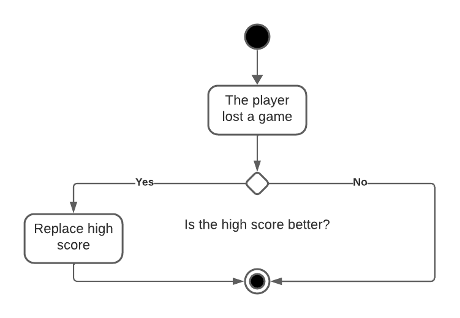
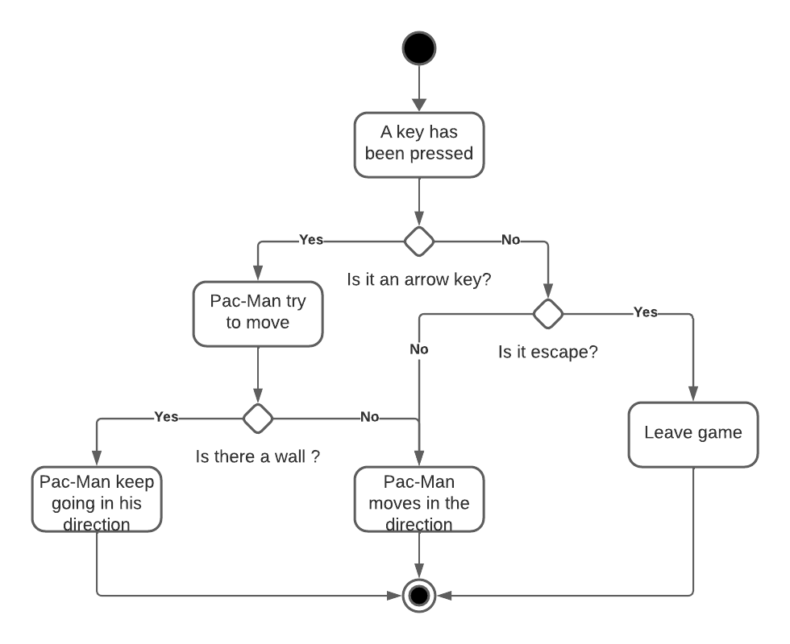
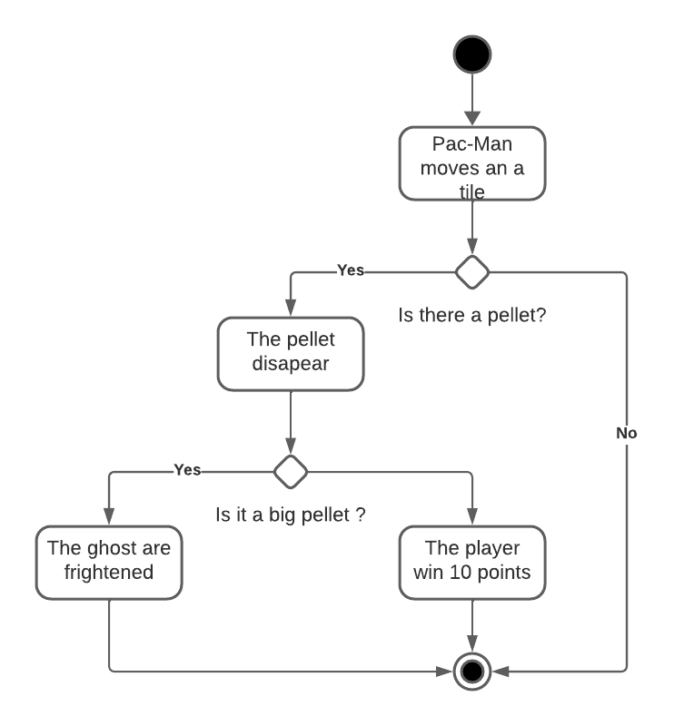
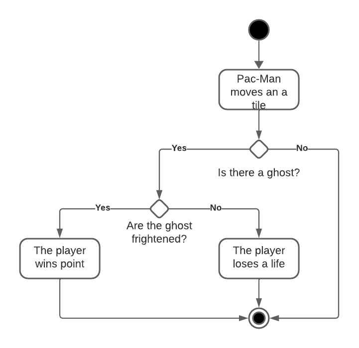

# Technical specification | Team 4

---

Table of Contents

- [Technical specification | Team 4](#technical-specification--team-4)
  - [Introduction](#introduction)
    - [Overview](#overview)
    - [Assumptions](#assumptions)
  - [Solutions](#solutions)
    - [Proposed Solution](#proposed-solution)
      - [Winning and losing solutions](#winning-and-losing-solutions)
      - [Graphism](#graphism)
      - [Moving](#moving)
      - [Ghost AI](#ghost-ai)
    - [Test Plan](#test-plan)
    - [Release Plan](#release-plan)
  - [Further Considerations](#further-considerations)
    - [Third-party services and platform considerations](#third-party-services-and-platform-considerations)
    - [Risks](#risks)
  - [Glossary](#glossary)

---

## Introduction

### Overview

ALGOSUP's school commissioned us to create a Pac-Man game clone in assembly x86 using DOSBox[^1]. The software's primary objective is to completely fit all the original gameplay systems.

### Assumptions

We assumed that copyright was not an issue. This is a student project for non-commercial purposes, and it is generally allowed to use assets from old games to create it.

---

## Solutions

### Proposed Solution

#### Winning and losing solutions

There are no "real" winning conditions in the original Pac-Man. When you collect all the pellets of a level, you would go to the next level, and so on. When reaching level 256, the game would bug due to some memory overflow, known as the map [256 glitch](https://pacman.fandom.com/wiki/Map_256_Glitch). The losing condition is when you run out of life. When this happens, if the score is better than the previous high score, then this score will be stored in place of the current one.
The losing codition is when you run out of lives. When this happens, if the score is better than the previous high score, then this score will be stored in place of the current one.

When all the pellets of a level have been eaten, the player progress to the next level. When a new level starts, Pac-Man and the ghosts are reset to their original position, and the levels is filled with pellets again.

#### Graphism

In order to draw the sprites, we have generated the bitmaps that will be used in our code.

As shown above, each ghosts has two separate sprite. By changing which sprite is displayed every 0.20 seconds, it will animate the sprites. Pac-Man has 3 different sprites. It also changes sprite every 0.20 seconds. When Pac-Man is not moving, he stays in the sprite he was before.
As the ghosts are looking in the direction they are moving in, the adequate sprite will be drawn on top of the ghosts at their position.
When the ghost are frightened, they turn dark blue. They start blinking in white 2 seconds before the end of the frightime.
Pac-Man has a death animation composed of 10 frames which last 1 second.

For the maze in itself, the layout will be defined before, and will be filled with pellets. In the middle, there will be the ghost house, which is where the ghosts spawn. Pac-Man start position is just underneath it.

#### Moving

When a key is pressed, these instructions will be applied

Then, the game will check what is on the tile

At the same time, the game will check if there is a ghost

The amount of point the user wins is determined by how many ghosts he ate during the current frightime. This go as follow:

|Number of ghost eaten|Points scored|
|---|---|
|1|200|
|2|400|
|3|800|
|4|1600|

Once a ghost is eaten, he goes back at his starting position, located in the middle of the maze. They go back as eyes. Once they respawned, they come back in their regular form, even if the frightime is not finished.

#### Ghost AI

Each ghost has a different comportment patern.

- Blinky, the red one, is the most agressive one. He is always chasing Pac-Man, wherever it goes. He starts outside of the maze, being the first one able to move freely in the maze.
- Pinky, the pink ghost, has a more strategic approach. Instead of targeting the position of Pac-Man, it targets the direction of Pac-Man, moving in parallel compared to the player. it is the second one to go out of the ghost home.
- Clyde, the orange one, has a more random movement. It's not actually always random. When Pac-Man is more than 8 tiles away, he directly target Pac-Man, like Blinky does. However, when he is closer to Pac-Man, he goes back into random mode., He is the third one, to go out of ghost home.
- Inky, the blue one, has the most complex patern. He is moving in relation to the position of both Pac-Man and Blinky. He always try to trap Pac-Man between him and Blinky. The farther Blinky is from Pac-Man, the more random he will move.

### Test Plan

For the test plan, please refer to [this document](../QA/test-plan.md).

### Release Plan

At first, the game will only be available as a .com[^2] file in the [repository](https://github.com/algosup/2023-2024-project-2-x86-retrogaming-team-4). In order to run this file, a DOS environment is required, such as DOSBox.

In a second time, the user would be able to download the latest release files and follow the installation steps which will be described in the README. The user will launch the compiled program, which is executed on the same platform, thanks to the DOSBox emulator.

---

## Further Considerations

### Third-party services and platform considerations
- Our code base will be hosted on [GitHub](https://github.com) on [this repository](https://github.com/algosup/2023-2024-project-2-x86-retrogaming-team-4/). In case of an outage of the website or its closure, the source code and compiled files of the releases will not be accessible and downloadable for the end-user.
- DOSBox is an external platform downloadable via [DOSBox's official website](https://www.dosbox.com/). In case of an outage of the website or its closure, the executable file allowing the program to run on different platforms the assembly files will not be :
  - Use an alternative such as [DOSBox-X](https://dosbox-x.com/) or [DOSBox SVN Daum](http://ykhwong.x-y.net/). However, these pieces of software may require some code adaptations.
  - Download it from other sources. As DOSBox is open-source, its source code can be downloaded from [SourceForge](https://sourceforge.net/projects/dosbox/).
- NASM (Netwide Assembler) is the assembly language compiler we are using to turn our assembly files into machine code files. It is available for download from the [NASM project official website](https://nasm.us/). If this site is unavailable or the project is terminated, the executable should be downloaded from another source:
  - [NASM GitHub official repository](https://github.com/netwide-assembler/nasm)
  - Via various package managers and command line:
    - apt: `sudo apt-get -y install nasm`
    - yum: `sudo dnf -y install nasm`
    - brew: `brew install nasm`

### Risks

|       Risk       | Impact                                                                                                                                                                                                                                                                                                                                                                                   | Mitigation                                                                                                                                                                                                                                                                                                                |
| :--------------: | :--------------------------------------------------------------------------------------------------------------------------------------------------------------------------------------------------------------------------------------------------------------------------------------------------------------------------------------------------------------------------------------- | :------------------------------------------------------------------------------------------------------------------------------------------------------------------------------------------------------------------------------------------------------------------------------------------------------------------------ |
|   Scope creep    | We might try to make the project too big which could lead to the project running out of time.                                                                                                                                                                                                                                                                                            | We must plan our work by doing a breakdown of the different tasks in sub-tasks and estimate a specific time which will be dedicated to this sub-task realisation.                                                                                                                                                         |
| Technical issues | Assembly, which is the language used during this project, is part of a niche for development as only a few software developers are still using this low-level language.  This explains why only a few people is our team already know how to code in depth with it. For this reason, many bugs or crashes could happen during the project realisation, mainly caused by memory leaks. | These unexpected behaviour must be found and patched as reliability and user friendliness are the key-points of a non-necessary software such as a video-game to keep users interested.  However, patching behaviour issues might be challenging as we may encounter errors which have not been previously documented. |
|Delays| Our project could be delayed because of some code-related bugs or issues, obliging us to spend more time than planned on a feature. | We will spend extra hours on the project as a consequence of potential delays|

---

## Glossary

[^1]: DOSBox is an emulator program that emulates an IBM PC-compatible computer running in a DOS operating system.

[^2]: A .com file is an assembly program already compiled. This file is meant to be used a DOS or MS-DOS environment.
