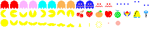

# Technical specification | Team 4

---

Table of Contents

- [Technical specification | Team 4](#technical-specification--team-4)
  - [Introduction](#introduction)
    - [Overview](#overview)
    - [Assumptions](#assumptions)
  - [Game mechanics](#game-mechanics)
    - [Graphism](#graphism)
    - [Fright time](#fright-time)
    - [Score management](#score-management)
    - [Ghost AI](#ghost-ai)
    - [Collision Handling](#collision-handling)
    - [Level Progression](#level-progression)
    - [Game Over](#game-over)
  - [Game run](#game-run)
    - [Game initialization](#game-initialization)
    - [Game loop](#game-loop)
      - [Input check](#input-check)
      - [Game update](#game-update)
      - [Rendering](#rendering)
      - [Sound](#sound)
  - [Test Plan](#test-plan)
  - [Release Plan](#release-plan)
  - [Further Considerations](#further-considerations)
    - [Third-party services and platform considerations](#third-party-services-and-platform-considerations)
    - [Risks](#risks)
  - [Glossary](#glossary)

---

## Introduction

### Overview

ALGOSUP's school commissioned us to create a Pac-Man game clone in assembly x86 using DOSBox[^1]. The software's primary objective is to completely fit all the original gameplay systems.

### Assumptions

We assumed that copyright was not an issue. This is a student project for non-commercial purposes, and it is generally allowed to use assets from old games to create it.

---

## Game mechanics

### Graphism

The different sprites will be drawn according to this spritesheet.

As shown above, each ghosts has two separate sprite. We can create animations by changing which sprite is displayed every 0.25 second. Pac-Man has also 2 different sprites, being the ones with the mouse half opened and fully opened. We can create the same animation by alterning each 0.25 second.
We can rotate these 2 sprites to make sure that Pac-Man can face all 4 directions.
As the ghosts are looking in the direction they are moving in, the adequate eye sprite will be drawn on top of the ghosts at their position.
When the ghost are frightened, they turn dark blue, and keep the same kind of animation than before. They start blinking in white 2 seconds before the end of the fright time.
When a ghost is eaten, only its eyes remains, which head back to the ghost house. Once arrived, the ghost eaten goes back in his original.
Pac-Man has a death animation composed of 10 frames which last 1 second.

The maze layout is this one.

The rectangle in the middle of the maze is called the ghost house. This is where 3 out of the 4 ghosts start, and where they come back when they have been eaten.
The fruits appear on the row just below the ghost house, in the middle of the row.

### Fright time

Each time a big pellet is eaten, the game enters fright time. During this time, Pac-Man becomes invulnerable and ghosts can be eaten.
The duration is 6 seconds in the first level, and change as the levels go along.

| Level | Duration of the ghosts frightening (in seconds) |
| --- | --- |
| 1            |6|
| 2            |5|
| 3            |4|
| 4            |3|
| 5            |2|
| 6            |5|
| 7 and 8      |2|
| 9            |1|
| 10           |5|
| 11           |2|
| 12 and 13    |1|
| 14           |3|
| 15 and 16    |1|
| 17           |0|
| 18           |1|
| 19 and after | 0|

The ghosts start blinking 2 seconds before the ned of the fright time to indicate to the player that the game will soon be reversed to its normal state. If the fright time is 2 seconds or less, the ghosts already start blinking.

### Score management

Each small pellet eaten is worth 10 points. Each big one is worth 50 points.
A fruit, a cherry for us, appears just below the ghost house when 70 pellet have been eaten. It will stay there for 10 seconds. Another fruit can spawn when 170 pellets have been eaten.
The number of points ghosts can give you is as follow.

|Number of ghost eaten|Points scored|
|---|---|
|1|200|
|2|400|
|3|800|
|4|1600|

The cherry is worth 100 points. This mean that in a level, the player can reach a maximum of 14800 points, if he eats the 4 ghosts during the 4 fright time available, and get the two cherry that appear on the level.
A player can get a life each 10000 points reached.

### Ghost AI

Each ghost has a different comportment patern.

- Blinky, the red one, is the most agressive one. He is always chasing Pac-Man, wherever it goes. He starts outside of the ghost house, being the first one able to move freely in the maze. He always try to reach the exact tile Pac-Man is on.
- Pinky, the pink ghost, has a more strategic approach. Instead of targeting the position of Pac-Man, it targets the direction of Pac-Man, moving in parallel compared to the player. it is the second one to go out of the ghost home. He aims for 4 tiles ahead of Pac-Man, leading him to always try to trap him rather than chase him like blinky.
- Clyde, the orange one, has a more random movement. It's not actually always random. When Pac-Man is more than 8 tiles away, he directly target Pac-Man, like Blinky does. However, when he is closer to Pac-Man like Blinky, he goes back into random mode. He is the third one, to go out of ghost home.
- Inky, the blue one, has the most complex patern. He is moving in relation to the position of both Pac-Man and Blinky. He always try to trap Pac-Man between him and Blinky. The farther Blinky is from Pac-Man, the more random he will move.

### Collision Handling

We need to handle collisions. There are three types of collision: walls, ghosts, and score elements.

- Walls: When Pac-Man collides with a walls, it stops in the frame it is in and don't move until a new input is provided. To check where Pac-Man and the ghosts can go, we will use a table compose of 0 and 1, with 0 for the tile where it is not possible to move on and 1 for where it is possible. The only special wall will the door of the ghost house. It is a one way door, and only the ghost can go through it.
- When Pac-Man collides with a score element, such as pellets, he win points according to the element encountered. The element is then cleared from the current level layout. It reappear when the level is finished.
- When Pac-Man collides with a ghost, there are 2 different outcomes. The first one is that Pac-Man loses a life. When so, both Pac-Man and the ghosts respawn at their starting position, and eaten pellets remain eaten until the end of level. The second one is that Pac-Man eats the ghost, winning points and making the ghost reappaer at the ghost house.

### Level Progression

When all the pellets of a level have been eaten, the player progress to the next level. When a new level starts, Pac-Man and the ghosts are reset to their original position, and the levels is filled with pellets again.
When the player reach a new level, the maze is reset and the difficulty increase. It increases by reducing the duration of the fright time, and increasing the movement speed of the ghosts.
There are no "real" winning conditions in the original Pac-Man. When you collect all the pellets of a level, you would go to the next level, and so on. When reaching level 256, the game would bug due to some memory overflow, known as the map [256 glitch](https://pacman.fandom.com/wiki/Map_256_Glitch).

### Game Over

A Game Over occurs when the player loses all his lives. Then, the Game Over animation of Pac-Man displays and the score is set as high score if ot is higher than the previous one. The player just have to press a key to start a new game.
If the player close the game, the current high score will be deleted and will not be saved for when the player launch the program.

## Game run

### Game initialization

The first thing that has to be done is to set up the graphic mode. In our case, the graphic mode used will be a VGA mode, with a screen resolution of 640 by 480 pixels and 16 colors available, video mode 12h.
For the audio, we will use the melody and notes of the original music, already generated in the code.
The high score will be set back to 0. The player starts with 3 lives and 0 points at level 1.
The placement of the pellets, Pac-Man and the ghosts as well are their starting directions are as follow.

There are 240 small pellet, as well as 4 big ones.
The player has to wait for the intro music to stop in order for him to be able to move.

### Game loop

A game loop is executed at each frame.

#### Input check

At each game loop, the first step is to check if the player did an input, and check what the input is. Only 5 input are recognized by the game, all 4 direction arrows and escape. The direction arrows are used to move in the maze, only if possible. It is possible to move in a direction only if there are no walls. Escape is used to quit the game at any time. When the game is closed, all progression is lost.

#### Game update

Position of both Pac-Man and the ghosts are updated first. Ghosts' positions is updated thanks to their [behavioural AI](#ghost-ai). Pac-Man continues to move in the same direction if nothing was input, or in the inputed direction if possible. Pac-Man can do 180°, while the ghosts cannot.
Points, level and lives will be updated if the conditions to update them are complete.
Win and lose conditions are also checked at this step.

#### Rendering

After updating their position in the code, we have to display their actual new position in the maze. It includes fruits if the conditions are met, pellets, ghosts and Pac-Man.

#### Sound

Here, we need to check if any sound effect needs to be played depending on the situation, and output them.
Else, the background music should be looping, or continue where it was stopped for a sound effect.

## Test Plan

For the test plan, please refer to [this document](../QA/test-plan.md).

## Release Plan

At first, the game will only be available as a .com[^2] file in the [repository](https://github.com/algosup/2023-2024-project-2-x86-retrogaming-team-4). In order to run this file, a DOS environment is required, such as DOSBox.

In a second time, the user would be able to download the latest release files and follow the installation steps which will be described in the README. The user will launch the compiled program, which is executed on the same platform, thanks to the DOSBox emulator.

---

## Further Considerations

### Third-party services and platform considerations

- Our code base will be hosted on [GitHub](https://github.com) on [this repository](https://github.com/algosup/2023-2024-project-2-x86-retrogaming-team-4/). In case of an outage of the website or its closure, the source code and compiled files of the releases will not be accessible and downloadable for the end-user.
- DOSBox is an external platform downloadable via [DOSBox's official website](https://www.dosbox.com/). In case of an outage of the website or its closure, the executable file allowing the program to run on different platforms the assembly files will not be :
  - Use an alternative such as [DOSBox-X](https://dosbox-x.com/) or [DOSBox SVN Daum](http://ykhwong.x-y.net/). However, these pieces of software may require some code adaptations.
  - Download it from other sources. As DOSBox is open-source, its source code can be downloaded from [SourceForge](https://sourceforge.net/projects/dosbox/).
- NASM (Netwide Assembler) is the assembly language compiler we are using to turn our assembly files into machine code files. It is available for download from the [NASM project official website](https://nasm.us/). If this site is unavailable or the project is terminated, the executable should be downloaded from another source:
  - [NASM GitHub official repository](https://github.com/netwide-assembler/nasm)
  - Via various package managers and command line:
    - apt: `sudo apt-get -y install nasm`
    - yum: `sudo dnf -y install nasm`
    - brew: `brew install nasm`

### Risks

| Risk |Impact | Mitigation |
|---| --- | --- |
|   Scope creep    | We might try to make the project too big which could lead to the project running out of time.| We must plan our work by doing a breakdown of the different tasks in sub-tasks and estimate a specific time which will be dedicated to this sub-task realisation. |
| Technical issues | Assembly, which is the language used during this project, is part of a niche for development as only a few software developers are still using this low-level language.  This explains why only a few people is our team already know how to code in depth with it. For this reason, many bugs or crashes could happen during the project realisation, mainly caused by memory leaks. | These unexpected behaviour must be found and patched as reliability and user friendliness are the key-points of a non-necessary software such as a video-game to keep users interested.  However, patching behaviour issues might be challenging as we may encounter errors which have not been previously documented. |
|Delays| Our project could be delayed because of some code-related bugs or issues, obliging us to spend more time than planned on a feature. | We will spend extra hours on the project as a consequence of potential delays|

---

## Glossary

[^1]: DOSBox is an emulator program that emulates an IBM PC-compatible computer running in a DOS operating system.

[^2]: A .com file is an assembly program already compiled. This file is meant to be used a DOS or MS-DOS environment.
